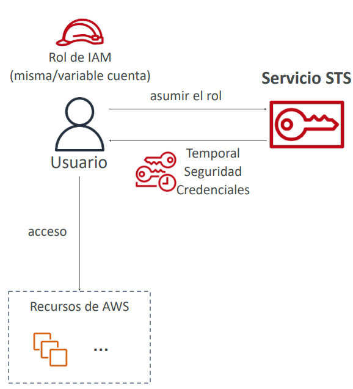
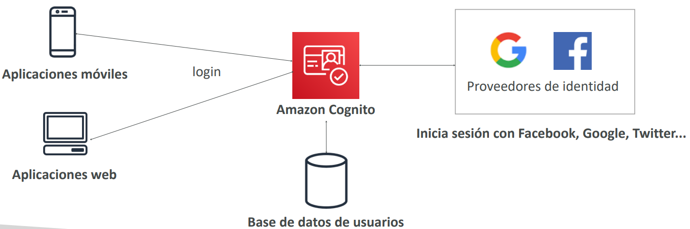
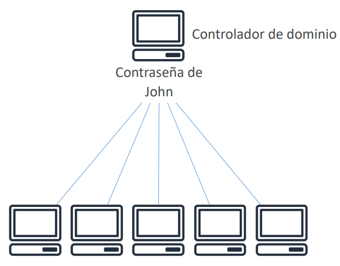
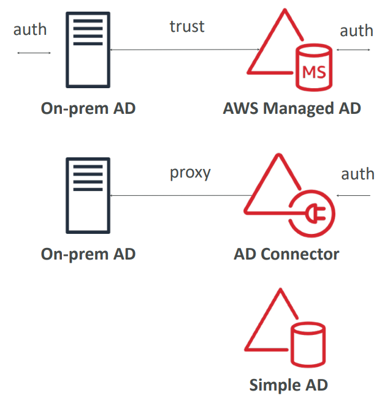

# Identidad Avanzada

## [AWS STS (Security Token Service)](https://docs.aws.amazon.com/STS/latest/APIReference/welcome.html)
- Te permite crear credenciales **temporales con privilegios limitados** para acceder a tus recursos de AWS
- Credenciales de corta duración: configuras el periodo de caducidad

> *Casos de uso:*
> - **Federación de identidades:** gestionar las identidades de los usuarios en sistemas externos, y proporcionarles tokens STS para acceder a los recursos de AWS
> - **Roles IAM para el acceso cruzado o de la misma cuenta**
> - **Roles IAM para Amazon EC2:** proporciona credenciales temporales para que las instancias EC2 accedan a los recursos de AWS

## [AWS Cognito (Simplificado)](https://aws.amazon.com/cognito)
- **Identidad para tus usuarios de aplicaciones web y móviles (potencialmente millones)**
- En lugar de crearles un usuario IAM, crea un usuario en Cognito

## [AWS Active Directory](https://aws.amazon.com/directoryservice)
### ¿Qué es Microsoft Active Directory AD?
- Se encuentra en cualquier servidor Windows con servicios de dominio AD
- Base de datos de **objetos**: Cuentas de usuario, ordenadores, impresoras, archivos compartidos, grupos de seguridad
- Gestión centralizada de la seguridad, creación de cuentas, asignación de permisos

### ¿Qué es AWS Directory Services?
- **AWS Managed Microsoft AD**
    - Crea tu propio AD en AWS, administra los usuarios localmente, soporta MFA
    - Establece conexiones de "confianza" con tu AD local
- **AD Conector**
    - Directory Gateway (proxy) para redirigir al AD local, soporta MFA
    - Los usuarios se gestionan en el AD local
- **Simple AD**
    - Directorio gestionado compatible con AD en AWS
    - No se puede unir con el AD local

## [AWS IAM Identity Center](https://aws.amazon.com/iam/identity-center) - (sucesor de AWS Single Sign-On)
- Un inicio de sesión (inicio de sesión único) para todas tus
    - **Cuentas de AWS en AWS Organizations**
    - Aplicaciones empresariales en el Cloud (por ejemplo, Salesforce, Box, Microsoft 365, ...)
    - Aplicaciones habilitadas para SAML2.0
    - Instancias de Windows EC2
- Proveedores de identidad
    - Almacén de identidades incorporado en IAM Identity Center
    - De terceros: Active Directory (AD), OneLogin, Okta...

## Resumen - Identidad avanzada
- **IAM**
    - Gestión de la identidad y el acceso dentro de tu cuenta de AWS
    - Para usuarios de confianza y pertenecientes a tu empresa
- **Organizations:** gestionar varias cuentas de AWS
- **Security Token Service (STS):** credenciales temporales con privilegios limitados para acceder a los recursos de AWS
- **Cognito:** crea una base de datos de usuarios para tus aplicaciones móviles y web
- **Directory Services:** integra Microsoft Active Directory en AWS
- **IAM Identity Center:** un inicio de sesión para varias cuentas y aplicaciones de AWS

