

# Otros Servicios

> [!NOTE]
> - Los otros servicios representan servicios que no pude agrupar con los otros
> - Son servicios que, según los estudiantes, aparecen a veces, pero raramente, en el examen de AWS
> - Las clases son cortas y breves y, probablemente, sin prácticas
> - No hay clase de resumen al final de la sección para mantener la flexibilidad

## [Amazon WorkSpaces](https://aws.amazon.com/workspaces)
- Solución de escritorio gestionado como servicio (DaaS) para **aprovisionar** fácilmente **escritorios Windows o Linux**
- **Genial para eliminar la gestión de la VDI (Infraestructura de Escritorio Virtual) local**
- Rápidamente escalable a miles de usuarios
- Datos seguros: se integra con KMS (Key Management Service)
- Servicio de pago por uso con tarifas mensuales o por hora

### Amazon WorkSpaces - Varias regiones

> [!TIP]
> **Sugerencia de examen:** cada vez que nos pregunten sobre **"espacios de trabajo"** o **"workspaces"** piensa en **Amazon WorkSpaces**.

## [Amazon AppStream 2.0](https://aws.amazon.com/appstream2)
- Servicio de streaming de aplicaciones de escritorio para usuarios
- Entrega a cualquier ordenador, sin adquirir, infraestructura de aprovisionamiento

> [!TIP]
> **Sugerencia de examen:** siempre que pregunten sobre **entregar una aplicación desde un navegador web** sin necesidad de conectarse a una VDI, piensa en **Amazon AppStream 2.0**.

## Amazon AppStream 2.0 vs WorkSpaces
### Workspaces
- Dispones de una VDI y un escritorio totalmente gestionados
- Los usuarios se conectan a la VDI y abren aplicaciones nativas o WAM
- Los espacios de trabajo están bajo demanda o siempre encendidos

### AppStream 2.0
- Transmite una aplicación de escritorio a los navegadores web (sin necesidad de
conectarse a una VDI)
- Funciona con cualquier dispositivo (que tenga un navegador web)
- Permite configurar un tipo de instancia por tipo de aplicación (CPU, RAM, GPU)

## [AWS IoT Core](https://aws.amazon.com/iot-core/)

- **IoT** son las siglas de **"Internet de las Cosas"**, la red de dispositivos conectados a Internet capaces de recopilar y transferir datos.
- El **núcleo de IoT de AWS** te permite **conectar fácilmente dispositivos IoT al Cloud de AWS**.
- **Sin servidor, seguro y escalable** a miles de millones de dispositivos y billones de mensajes.
- Tus aplicaciones pueden comunicarse con tus dispositivos **aunque no estén conectados**.
- Se integra con muchos servicios de **AWS** (Lambda, S3, SageMaker, etc.).
- Construye aplicaciones IoT que **recopilen, procesen, analicen y actúen sobre los datos**.

> [!TIP]
> **Sugerencia de examen:** siempre que la pregunta mencione **dispositivos conectados, IoT (Internet de las Cosas), miles de millones de dispositivos** o sensores enviando datos al Cloud, piensa en **AWS IoT Core**.

## [AWS AppSync](https://aws.amazon.com/appsync)
- Almacena y sincroniza los datos entre las aplicaciones móviles y web en tiempo real
- **Utiliza GraphQL (tecnología móvil de Facebook)**
- El código del cliente se puede generar automáticamente con GraphQL 
- Integraciones con DynamoDB / Lambda
- Suscripciones en tiempo real
- Sincronización de datos sin conexión (sustituye a Cognito Sync)
- AWS Amplify puede aprovechar AWS AppSync en segundo plano

## [AWS Amplify](https://aws.amazon.com/amplify)
- Un conjunto de herramientas y servicios que te ayudan a **desarrollar y desplegar aplicaciones web y móviles escalables**
- Autenticación, almacenamiento, API (REST, GraphQL), CI/CD, PubSub, análisis, predicciones de IA/ML, monitorización, código fuente de AWS, GitHub, etc.

> [!TIP]
> **Sugerencia de examen:** siempre que pregunten sobre una **suite o conjunto de herramientas para desarrollar y desplegar aplicaciones web/móviles** (autenticación, API, CI/CD, almacenamiento), piensa en **AWS Amplify**.

## [AWS Infrastructure Composer](https://aws.amazon.com/infrastructure-composer/)
- **Diseña y crea** visualmente aplicaciones serverless de forma rápida en AWS
- **Despliega código de infraestructura** en AWS sin necesidad de ser un experto en AWS
- Configura cómo interactúan tus recursos entre sí
- Genera Infraestructura como Código (IaC) usando CloudFormation
- **Permite importar plantillas existentes** de CloudFormation / SAM para visualizarlas

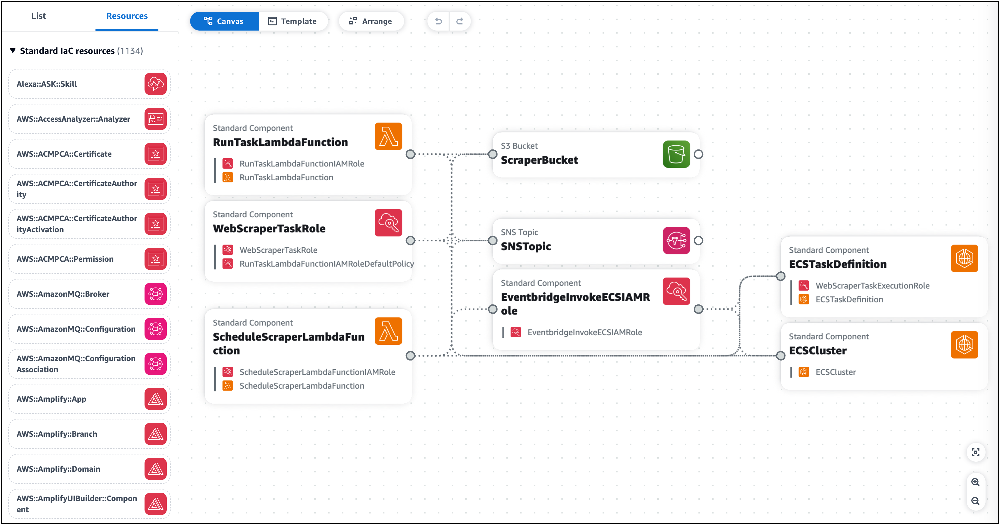

## [AWS Device Farm](https://aws.amazon.com/device-farm)
- Servicio totalmente gestionado que prueba tus aplicaciones web y móviles en navegadores de escritorio, dispositivos móviles reales y tabletas
- Ejecuta pruebas simultáneamente en varios dispositivos (acelera la ejecución)
- Posibilidad de configurar los ajustes del dispositivo (GPS, idioma, Wi-Fi, Bluetooth, ...)

## [AWS Backup](https://aws.amazon.com/backup)
- Servicio totalmente gestionado para administrar y automatizar centralmente las copias de seguridad en todos los servicios de AWS
- Copias de seguridad bajo demanda y programadas
- Soporta PITR (Point-in-time Recovery)
- Períodos de retención, gestión del ciclo de vida, políticas de copia de seguridad, ...
- Copia de seguridad entre regiones
- Copia de seguridad entre cuentas (usando AWS Organizations)

## Estrategias de recuperación de desastres

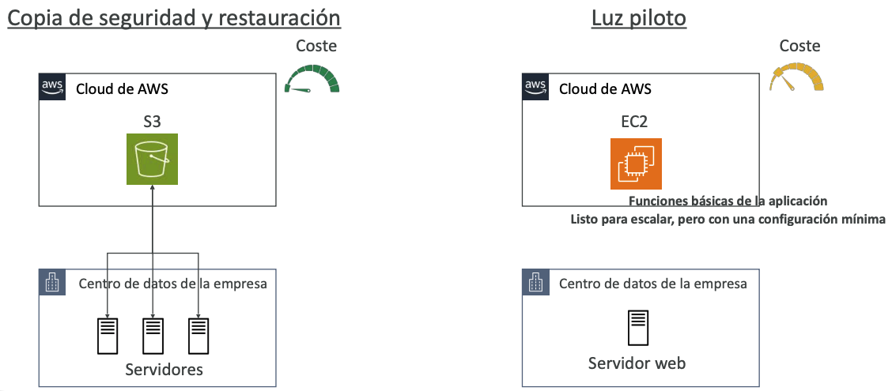

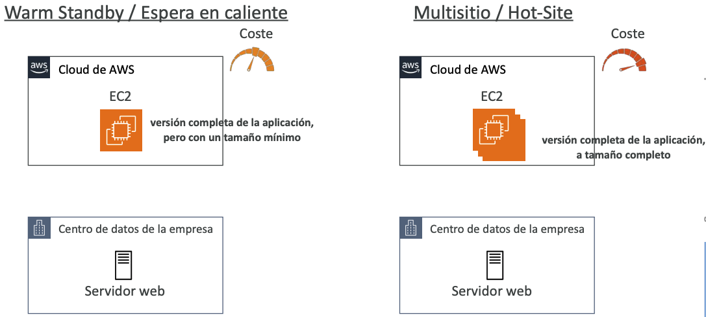

### Configuración típica de RD para implementaciones en el Cloud

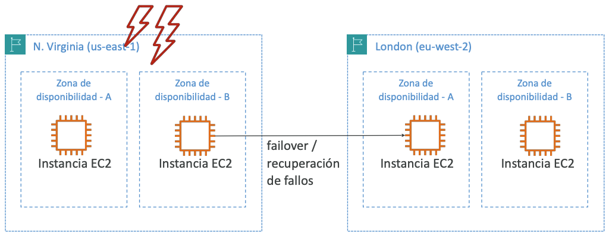

## [AWS Elastic Disaster Recovery (DRS)](https://aws.amazon.com/disaster-recovery)

> Antes se llamaba “CloudEndure Disaster Recovery”

- **Recupera rápida y fácilmente tus servidores físicos, virtuales y en la nube en AWS**
- Ejemplo: protege tus bases de datos más críticas (incluyendo Oracle, MySQL y SQL Server), aplicaciones empresariales (SAP)...
- Replicación continua a nivel de bloque para tus servidores

> [!TIP]
> **Sugerencia de examen:** siempre que pregunten por **recuperación ante desastres (DR)** de servidores **físicos, virtuales u on-premises** hacia AWS con **replicación continua a nivel de bloque**, piensa en **AWS Elastic Disaster Recovery (DRS)**. Antes era *CloudEndure Disaster Recovery*.

## [AWS DataSync](https://aws.amazon.com/datasync/)
- Mueve una gran cantidad de datos de las instalaciones a AWS
- Puedes sincronizar a: Amazon S3 (cualquier clase de almacenamiento - incluyendo Glacier), Amazon EFS, Amazon FSx para Windows
- Las tareas de replicación se pueden programar cada hora, cada día, cada semana
- Las tareas de replicación son **incrementales** después de la primera carga completa

> [!TIP]
> **Sugerencia de examen:** siempre que pregunten sobre **cargas de datos incrementales** programadas (cada hora/día/semana) de las instalaciones al cloud (S3, EFS, FSx Windows), piensa en **AWS DataSync**.

## Estrategias de migración a la nube: las 7R

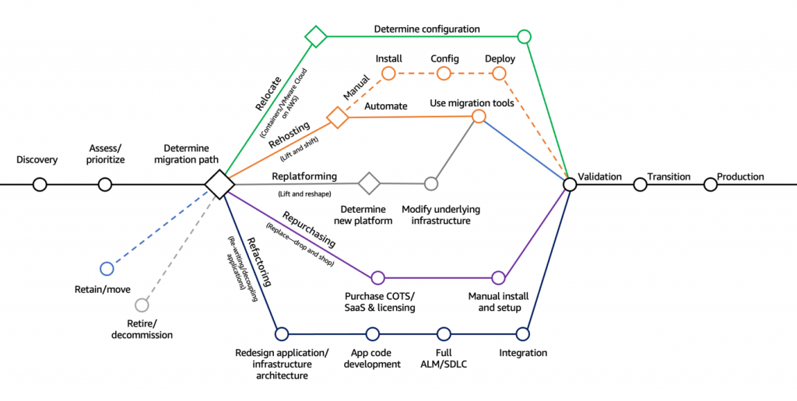

### Retire
  - Apaga o elimina lo que no necesitas (quizá como resultado de una re-arquitectura)
  - Ayuda a reducir la superficie de ataque (mayor seguridad)
  - Ahorra costos, quizá entre 10% y 20%
  - Enfoca tu atención en los recursos que realmente deben mantenerse

### Retain
  - No hacer nada por ahora (también es una decisión válida dentro de una migración a la nube)
  - Factores como seguridad, cumplimiento de datos, rendimiento o dependencias no resueltas
  - No existe valor de negocio para migrar, por ejemplo en mainframes, sistemas mid-range y aplicaciones Unix no x86

### Relocate
  - Mover aplicaciones desde on-premises a su versión en la nube
  - Mover instancias EC2 a una VPC diferente, a otra cuenta de AWS o a otra región de AWS
  - Ejemplo: transferir servidores desde un VMware Software-defined Data Center (SDDC) hacia VMware Cloud on AWS

### Rehost ("lift and shift")
  - Migraciones simples mediante rehosting en AWS (aplicaciones, bases de datos, datos…)
  - Migrar máquinas (físicas, virtuales o desde otra nube) hacia AWS Cloud
  - No se realizan optimizaciones para la nube; la aplicación se migra tal como está
  - Puede ahorrar hasta 30% en costos
  - Ejemplo: migrar usando AWS Application Migration Service

### Replatform ("lift and reshape")
  - Ejemplo: migrar tu base de datos a RDS
  - Ejemplo: migrar tu aplicación a Elastic Beanstalk
  - No se cambia la arquitectura principal, pero se aprovechan algunas optimizaciones de la nube
  - Ahorra tiempo y dinero al moverse a un servicio totalmente administrado o serverless

### Repurchase ("drop and shop")
  - Migrar a un producto diferente mientras te mueves a la nube
  - A menudo se migra a una plataforma SaaS
  - Es más costoso a corto plazo, pero rápido de implementar
  - Ejemplo: CRM a Salesforce.com, RR. HH. a Workday, CMS a Drupal

### Refactor / Re-arquitectura
  - Reimaginar cómo está arquitecturada la aplicación usando características cloud-native
  - Impulsado por la necesidad del negocio de agregar funcionalidades y mejorar la escalabilidad, el rendimiento, la seguridad y la agilidad
  - Pasar de una aplicación monolítica a microservicios
  - Ejemplo: mover una aplicación a arquitecturas serverless, usar Amazon S3

## [AWS Application Discovery Service](https://aws.amazon.com/application-discovery/)
- Planificar los proyectos de migración recopilando información sobre los centros de datos locales
- Los datos de utilización de los servidores y la asignación de dependencias son importantes para las migraciones
- **Descubrimiento sin agente (AWS Agentless Discovery Connector)**
  - Inventario de máquinas virtuales, configuración e historial de rendimiento, como el uso de la CPU, la memoria y el disco
- **Descubrimiento basado en agentes (AWS Application Discovery Agent)**
  - Configuración del sistema, rendimiento del sistema, procesos en ejecución y detalles de las conexiones de red entre sistemas
- Los datos resultantes pueden verse en el AWS Migration Hub

## [AWS Application Migration Service (MGN)](https://aws.amazon.com/application-migration-service/)
- *La "evolución AWS" de CloudEndure Migration, que sustituye al AWS Server Migration Service (SMS)*
- Solución Lift-and-shift que simplifica la migración de aplicaciones a AWS
- Convierte tus servidores físicos, virtuales y basados en la nube para que se ejecuten de forma nativa en AWS
- Soporta una amplia gama de plataformas, sistemas operativos y bases de datos

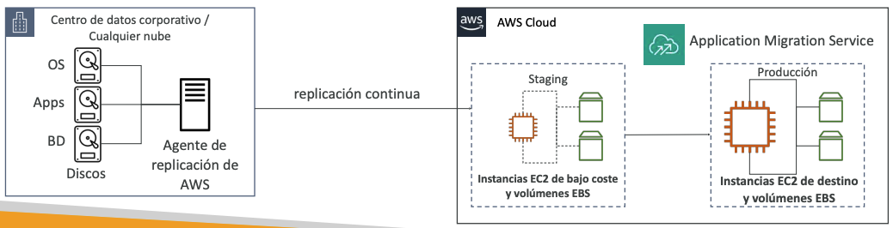

## [AWS Migration Evaluator](https://aws.amazon.com/migration-evaluator/)
- Te ayuda a crear un caso empresarial basado en datos para la migración a AWS
- Proporciona una línea de base clara de lo que tu organización está ejecutando actualmente
- Instala el Agentless Collector para llevar a cabo una amplia detección
- Toma una snapshot de la huella local, dependencias de servidores, ...
- Analiza el estado actual, define el estado objetivo y desarrolla un plan de migración

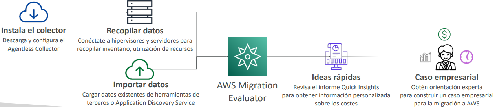

## [AWS Migration Hub](https://aws.amazon.com/migration-hub/)
- Ubicación central para recopilar el inventario de servidores y aplicaciones para la evaluación, planificación y seguimiento de migraciones hacia AWS
- Ayuda a acelerar tu migración a AWS y a automatizar procesos de lift-and-shift
- AWS Migration Hub Orchestrator proporciona plantillas preconstruidas para ahorrar tiempo y esfuerzo al migrar aplicaciones empresariales (por ejemplo: SAP, Microsoft SQL Server...)
- Admite actualizaciones del estado de migración desde Application Migration Service (MGN) y Database Migration Service (DMS)

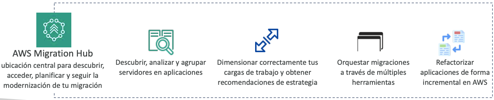

> [!TIP]
> **Sugerencia de examen — confusión clásica de herramientas de migración:**
> - **Migration Evaluator** → **caso de negocio / línea base de costos** antes de migrar.
> - **Application Discovery Service** → **inventario y dependencias** de los servidores on-premises (con o sin agente).
> - **Application Migration Service (MGN)** → **ejecuta** la migración lift-and-shift de servidores a AWS.
> - **Migration Hub** → **panel central** que rastrea el progreso de las migraciones (recibe estado de MGN y DMS).

## [AWS Fault Injection Simulator (FIS)](https://aws.amazon.com/fis/)
- Un servicio totalmente gestionado para ejecutar experimentos de inyección de fallos en las cargas de trabajo de AWS
- Basado en la **ingeniería del caos**: estresar una aplicación creando eventos perturbadores (por ejemplo, un aumento repentino de la CPU o la memoria), observar cómo responde el sistema e implementar mejoras
- Te ayuda a descubrir fallos ocultos y cuellos de botella en el rendimiento
- Soporta los siguientes servicios de AWS: EC2, ECS, EKS, RDS...
- Utiliza plantillas preconstruidas que generan las interrupciones deseadas

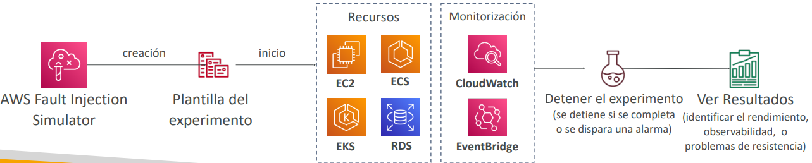

> [!TIP]
> **Sugerencia de examen:** siempre que la pregunta mencione **ingeniería del caos (chaos engineering)** o **inyección de fallos** para probar la resiliencia de cargas de trabajo (EC2, ECS, EKS, RDS), piensa en **AWS Fault Injection Simulator (FIS)**.

## [AWS Step Functions](https://aws.amazon.com/step-functions/)
- Construye un flujo de trabajo visual sin servidor para orquestar tus funciones Lambda
- **Características:** secuencia, paralelo, condiciones, tiempos de espera, manejo de errores, ...
- Puede integrarse con EC2, ECS, servidores locales, API Gateway, colas SQS, etc.
- Posibilidad de implementar la función de aprobación humana

> *Casos de uso:*
> - Cumplimiento de pedidos
> - Procesamiento de datos
> - Aplicaciones web
> - Cualquier flujo de trabajo

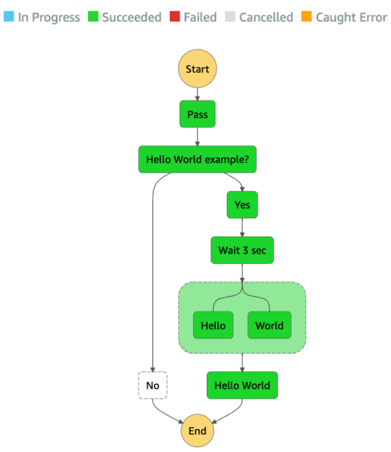

> [!TIP]
> **Sugerencia de examen:** siempre que pregunten por **orquestar un flujo de trabajo serverless** con secuencias, condiciones, paralelismo y manejo de errores (típicamente **encadenando funciones Lambda**), piensa en **AWS Step Functions**.

## [AWS Ground Station](https://aws.amazon.com/ground-station/)
- Servicio totalmente gestionado que te permite controlar las comunicaciones por satélite, procesar los datos y escalar tus operaciones por satélite
- Proporciona una red global de estaciones terrestres de satélites cerca de las regiones de AWS
- Te permite descargar los datos de los satélites a tu VPC de AWS en cuestión de segundos
- Envía los datos de los satélites a una instancia S3 o EC2

> *Casos de uso:*
> - Previsión meteorológica
> - Imágenes de superficie
> - Comunicaciones
> - Emisiones de vídeo

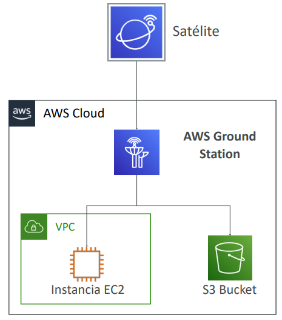

## [Amazon Pinpoint](https://aws.amazon.com/pinpoint/)
- Servicio escalable de comunicaciones de marketing **bidireccional (saliente/entrante)**
- Soporta correo electrónico, SMS, push, voz y mensajería in-app
- Posibilidad de segmentar y personalizar los mensajes con el contenido adecuado para los clientes
- Posibilidad de recibir respuestas
- Escala a miles de millones de mensajes al día

> *Casos de uso:*
> - Realiza campañas enviando mensajes SMS de marketing, masivos y transaccionales

### Frente a Amazon SNS o Amazon SES
- En **SNS** y **SES** gestionas la audiencia, el contenido y el calendario de entrega de cada mensaje
- En **Amazon Pinpoint**, creas plantillas de mensajes, horarios de entrega, segmentos altamente segmentados y campañas completas

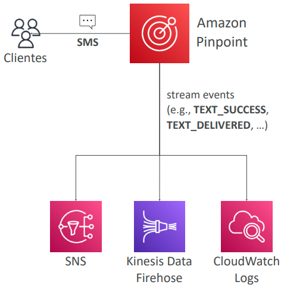

> [!TIP]
> **Sugerencia de examen:** siempre que la pregunta mencione **campañas de marketing bidireccionales** (SMS, email, push, voz, in-app) con **segmentación, plantillas y calendarios**, piensa en **Amazon Pinpoint**. No lo confundas con **SNS** (notificaciones simples pub/sub) ni **SES** (sólo correo transaccional).

