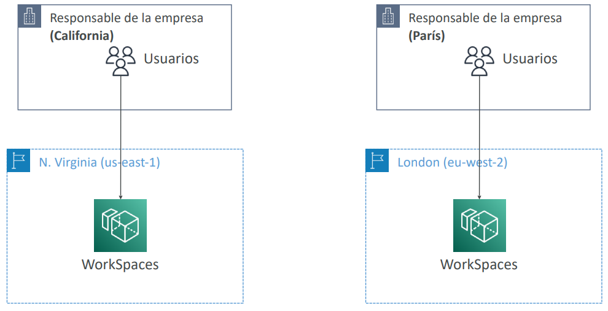
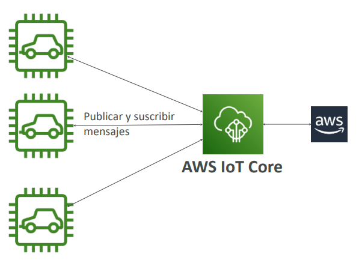
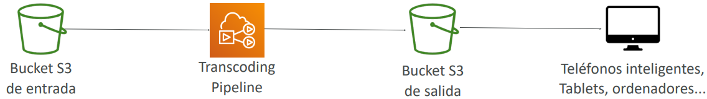
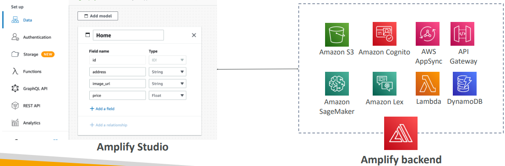
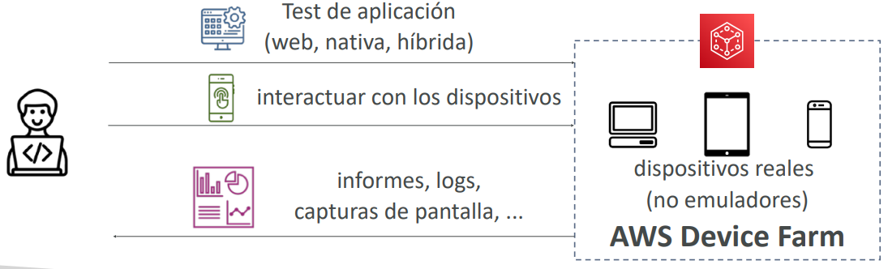
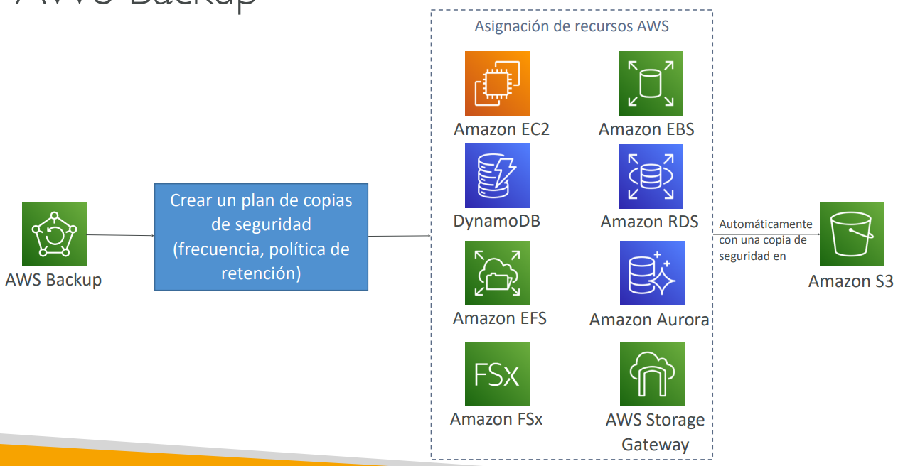
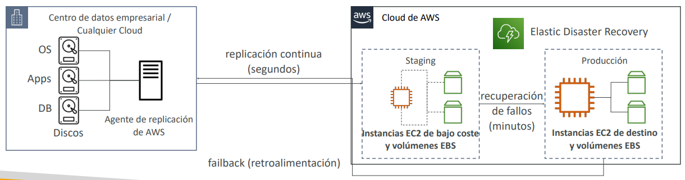
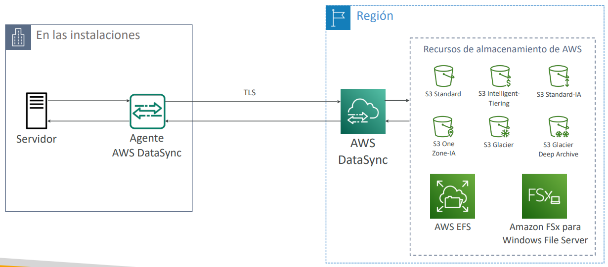

# Otros Servicios

> [!NOTE]
> - Los otros servicios representan servicios que no pude agrupar con los otros
> - Son servicios que, según los estudiantes, aparecen a veces, pero raramente, en el examen de AWS
> - Las clases son cortas y breves y, probablemente, sin prácticas
> - No hay clase de resumen al final de la sección para mantener la flexibilidad

## [Amazon WorkSpaces](https://aws.amazon.com/workspaces)
- Solución de escritorio gestionado como servicio (DaaS) para **aprovisionar** fácilmente **escritorios Windows o Linux**
- **Genial para eliminar la gestión de la VDI (Infraestructura de Escritorio Virtual) local**
- Rápidamente escalable a miles de usuarios
- Datos seguros: se integra con KMS (Key Management Service)
- Servicio de pago por uso con tarifas mensuales o por hora

### Amazon WorkSpaces - Varias regiones

> [!IMPORTANT]
> Cada vez que nos pregunten sobre "espacios de trabajo" o "workspaces" piensa en este servicio!

## [Amazon AppStream 2.0](https://aws.amazon.com/appstream2)
- Servicio de streaming de aplicaciones de escritorio para usuarios
- Entrega a cualquier ordenador, sin adquirir, infraestructura de aprovisionamiento

> [!IMPORTANT]
> Siemrpre que pregunten sobre entregar una aplicación desde un navegador web piensa en este servicio!

## Amazon AppStream 2.0 vs WorkSpaces
- **Workspaces**
- Dispones de una VDI y un escritorio totalmente gestionados
- Los usuarios se conectan a la VDI y abren aplicaciones nativas o WAM
- Los espacios de trabajo están bajo demanda o siempre encendidos

- **AppStream 2.0**
- Transmite una aplicación de escritorio a los navegadores web (sin necesidad de
conectarse a una VDI)
- Funciona con cualquier dispositivo (que tenga un navegador web)
- Permite configurar un tipo de instancia por tipo de aplicación (CPU, RAM, GPU)

## [Amazon Sumerian](https://aws.amazon.com/sumerian)

- Crea y ejecuta aplicaciones de **realidad virtual (RV)**, **realidad aumentada (RA)** y **3D**.
- Se puede utilizar para **crear rápidamente modelos 3D con animaciones**.
- Ofrece **plantillas y activos listos para usar**, sin necesidad de conocimientos de programación o modelado 3D.
- Es **accesible a través de la URL de un navegador web** o en hardware popular para **RA/VR**.

## [AWS IoT Core](https://aws.amazon.com/iot-core/)

- **IoT** son las siglas de **"Internet de las Cosas"**, la red de dispositivos conectados a Internet capaces de recopilar y transferir datos.
- El **núcleo de IoT de AWS** te permite **conectar fácilmente dispositivos IoT al Cloud de AWS**.
- **Sin servidor, seguro y escalable** a miles de millones de dispositivos y billones de mensajes.
- Tus aplicaciones pueden comunicarse con tus dispositivos **aunque no estén conectados**.
- Se integra con muchos servicios de **AWS** (Lambda, S3, SageMaker, etc.).
- Construye aplicaciones IoT que **recopilen, procesen, analicen y actúen sobre los datos**.

## [Amazon Elastic Transcoder](https://aws.amazon.com/elastictranscoder)
- Elastic Transcoder se utiliza para **convertir los archivos multimedia almacenados en S3 en archivos multimedia en los formatos requeridos por los dispositivos de reproducción de los consumidores (teléfonos, etc.)**
- Ventajas:
    - Fácil de usar
    - Altamente escalable - puede manejar grandes volúmenes de archivos multimedia y archivos de
    gran tamaño
    - Rentable: modelo de precios basado en la duración
    - Totalmente gestionado y seguro, paga por lo que usas

## [AWS AppSync](https://aws.amazon.com/appsync)
- Almacena y sincroniza los datos entre las aplicaciones móviles y web en tiempo real
- **Utiliza GraphQL (tecnología móvil de Facebook)**
- El código del cliente se puede generar automáticamente con GraphQL 
- Integraciones con DynamoDB / Lambda
- Suscripciones en tiempo real
- Sincronización de datos sin conexión (sustituye a Cognito Sync)
- AWS Amplify puede aprovechar AWS AppSync en segundo plano

## [AWS Amplify](https://aws.amazon.com/amplify)
- Un conjunto de herramientas y servicios que te ayudan a **desarrollar y desplegar aplicaciones web y móviles escalables**
- Autenticación, almacenamiento, API (REST, GraphQL), CI/CD, PubSub, análisis, predicciones de IA/ML, monitorización, código fuente de AWS, GitHub, etc.

> [!IMPORTANT]
> Siemrpre que pregunten sobre una suite o conjunto de herramientas para desarrollar y desplegar aplicaciones piensa en Amplify!

## [AWS Device Farm](https://aws.amazon.com/device-farm)
- Servicio totalmente gestionado que prueba tus aplicaciones web y móviles en navegadores de escritorio, dispositivos móviles reales y tabletas
- Ejecuta pruebas simultáneamente en varios dispositivos (acelera la ejecución)
- Posibilidad de configurar los ajustes del dispositivo (GPS, idioma, Wi-Fi, Bluetooth, ...)

## [AWS Backup](https://aws.amazon.com/backup)
- Servicio totalmente gestionado para administrar y automatizar centralmente las copias de seguridad en todos los servicios de AWS
- Copias de seguridad bajo demanda y programadas
- Soporta PITR (Point-in-time Recovery)
- Períodos de retención, gestión del ciclo de vida, políticas de copia de seguridad, ...
- Copia de seguridad entre regiones
- Copia de seguridad entre cuentas (usando AWS Organizations)

## [AWS Elastic Disaster Recovery (DRS)](https://aws.amazon.com/disaster-recovery)

> Antes se llamaba “CloudEndure Disaster Recovery”

- **Recupera rápida y fácilmente tus servidores físicos, virtuales y en la nube en AWS**
- Ejemplo: protege tus bases de datos más críticas (incluyendo Oracle, MySQL y SQL Server), aplicaciones empresariales (SAP)...
- Replicación continua a nivel de bloque para tus servidores

## [AWS DataSync](https://aws.amazon.com/datasync/)
- Mueve una gran cantidad de datos de las instalaciones a AWS
- Puedes sincronizar a: Amazon S3 (cualquier clase de almacenamiento - incluyendo Glacier), Amazon EFS, Amazon FSx para Windows
- Las tareas de replicación se pueden programar cada hora, cada día, cada semana
- Las tareas de replicación son **incrementales** después de la primera carga completa

> [!IMPORTANT]
> Siemrpre que pregunten sobre **cargas de datos incrementales** de las instalaciones al cloud piensa en DataSync!