

# Arquitectura y ecosistema de AWS

## Well Architected Framework - Principios generales de orientación
- Deja de adivinar tus necesidades de capacidad 
- Testea sistemas a escala de producción 
- Automatiza para facilitar la experimentación arquitectónica 
- Permite arquitecturas evolutivas 
    - Diseña en función de los requisitos cambiantes 
- Impulsa las arquitecturas utilizando datos 
- Mejorar mediante días de juego 
    - Simular aplicaciones para días de venta flash

## Mejores prácticas en el Cloud de AWS - Principios de diseño
- **Escalabilidad:** vertical y horizontal
- **Recursos desechables:** los servidores deben ser desechables y fácilmente configurables
- **Automatización:** Sin servidor, infraestructura como servicio, autoescalado...
- **Acoplamiento:**
    - Los monolitos son aplicaciones que hacen más y más con el tiempo, se hacen más grandes
    - Divídela en componentes más pequeños y débilmente acoplados
    - Un cambio o un fallo en un componente no debería afectar en cascada a otros componentes
- **Servicios, no servidores:**
    - No utilices sólo EC2
    - Utiliza servicios gestionados, bases de datos, serverless, etc.

## Well Architected Framework - 6 Pilares

1) **Excelencia operativa**
2) **Seguridad**
3) **Fiabilidad**
4) **Eficiencia del rendimiento**
5) **Optimización de costes**
6) **Sostenibilidad**

> *No son algo a equilibrar, ni a compensar, son una sinergia*

> [!TIP]
> **Sugerencia de examen:** memoriza los **6 pilares** (Excelencia operativa, Seguridad, Fiabilidad, Eficiencia del rendimiento, Optimización de costes, **Sostenibilidad**). El de **Sostenibilidad** se añadió en 2021 y es el que más sale en preguntas trampa.
>
> **Palabras-gatillo para distinguir cada pilar:**
>
> | Pilar | Palabras gatillo |
> |---|---|
> | **Excelencia operativa** | IaC, runbooks, automatización de procesos, monitorización proactiva, *cómo operas* |
> | **Seguridad** | IAM, cifrado, KMS, mínimo privilegio, protección contra **amenazas/ataques** |
> | **Fiabilidad** | multi-AZ, failover, backups, restore, replicación, **recuperarse de fallos** |
> | **Eficiencia del rendimiento** | tipo de instancia adecuado, serverless, latencia, CDN, caché, **right-sizing técnico** |
> | **Optimización de costes** | pago por uso, instancias reservadas/spot, etiquetas, ROI, **el menor coste** |
> | **Sostenibilidad** | impacto ambiental, eficiencia energética, reducir recursos ociosos |
>
> **Trampa más común — Fiabilidad vs Eficiencia del rendimiento:** ambos usan Auto Scaling, pero:
> - "**Reemplazar instancias en mal estado**" → Fiabilidad.
> - "**Adaptarse a la demanda / no aprovisionar de más**" → Eficiencia del rendimiento.
>
> **Distractores que NO son pilares** (los ponen como respuestas falsas): Disponibilidad, Escalabilidad, Agilidad, Elasticidad, Manejabilidad, Recuperabilidad.

## 1) Excelencia operativa

- Incluye la capacidad de **ejecutar y supervisar los sistemas** para aportar valor al negocio y **mejorar continuamente los procesos y procedimientos de soporte**.

- **Principios de diseño:**
  - **Realiza operaciones como código** — Infraestructura como código.
  - **Anotar la documentación** — Automatizar la creación de documentación anotada después de cada construcción.
  - **Realiza cambios frecuentes, pequeños y reversibles** — Para que, en caso de cualquier fallo, puedas revertirlo.
  - **Perfecciona los procedimientos de las operaciones con frecuencia** — Asegúrate de que los miembros del equipo estén familiarizados con ellos.
  - **Anticipa los fallos**
  - **Aprende de todos los fallos operativos**

### Servicios AWS - Excelencia operativa
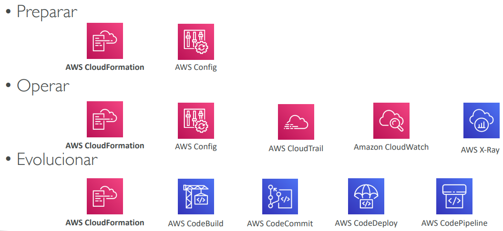

## 2) Seguridad
- Incluye la capacidad de **proteger la información, los sistemas y los activos** a la vez que se proporciona valor empresarial mediante evaluaciones de riesgo y estrategias de mitigación.
- **Principios de diseño:**
  - **Implementar una base sólida de identidad** — Centralizar la gestión de privilegios y reducir (o incluso eliminar) la dependencia de las credenciales a largo plazo. Principio de mínimo privilegio. IAM.
  - **Habilitar la trazabilidad** — Integrar logs y métricas con los sistemas para responder y actuar automáticamente.
  - **Aplicar la seguridad en todas las capas** — Como red de borde, VPC, subred, equilibrador de carga, cada instancia, sistema operativo y aplicación.
  - **Automatizar las mejores prácticas de seguridad**
  - **Protege los datos en tránsito y en reposo** — Cifrado, tokenización y control de acceso.
  - **Mantén a las personas alejadas de los datos** — Reduce o elimina la necesidad de acceso directo o procesamiento manual de los datos.
  - **Prepárate para los eventos de seguridad** — Realiza simulaciones de respuesta a incidentes y utiliza herramientas con automatización para aumentar la velocidad de detección, investigación y recuperación.
  - **Modelo de responsabilidad compartida**

### Servicios AWS - Seguridad
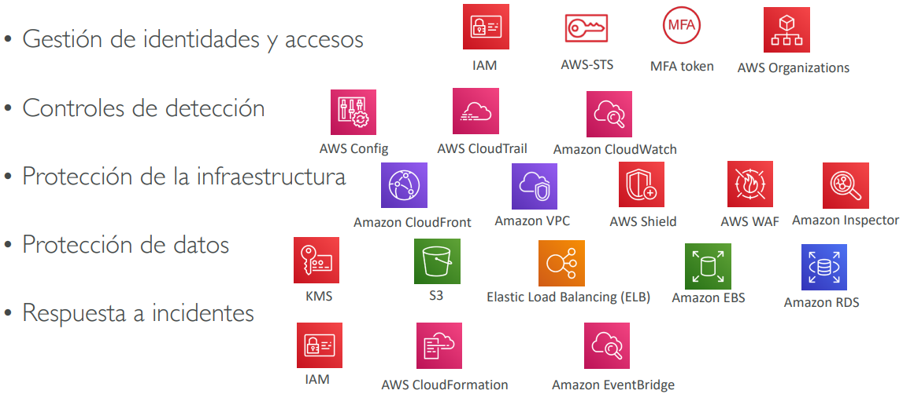

## 3) Fiabilidad
- Capacidad de un sistema para recuperarse de las interrupciones de la infraestructura o del servicio, adquirir dinámicamente recursos informáticos para satisfacer la demanda y mitigar las interrupciones, como las desconfiguraciones o los problemas transitorios de la red.
- **Principios de diseño:**
  - **Prueba los procedimientos de recuperación** — Utiliza la automatización para simular diferentes fallos o para recrear escenarios que hayan provocado fallos anteriormente.
  - **Recupérate automáticamente de los fallos** — Anticipa y remedia los fallos antes de que se produzcan.
  - **Escala horizontalmente para aumentar la disponibilidad agregada del sistema** — Distribuye las peticiones entre múltiples recursos más pequeños para asegurar que no comparten un punto de fallo común.
  - **Deja de adivinar la capacidad** — Mantén el nivel óptimo para satisfacer la demanda sin aprovisionamiento excesivo o insuficiente. Utiliza el escalado automático.
  - **Gestiona el cambio en la automatización** — Utiliza la automatización para realizar cambios en la infraestructura.

### Servicios AWS - Fiabilidad
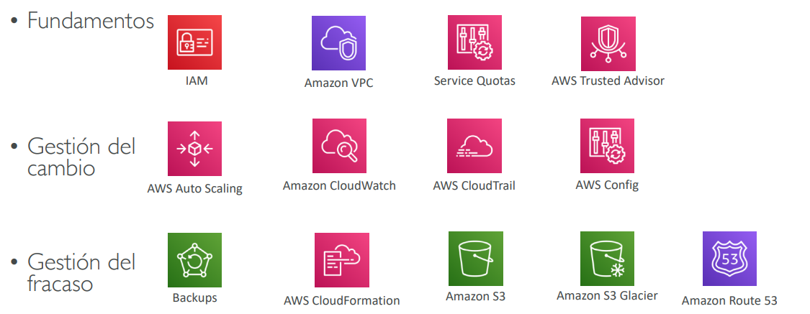

## 4) Eficiencia del rendimiento
- Incluye la capacidad de **utilizar los recursos informáticos de forma eficiente** para satisfacer los requisitos del sistema, y de mantener esa eficiencia a medida que cambia la demanda y evolucionan las tecnologías.
- **Principios de diseño:**
  - **Democratizar las tecnologías avanzadas** — Las tecnologías avanzadas se convierten en servicios y, por tanto, puedes centrarte más en el desarrollo de productos.
  - **Hazte global en minutos** — Despliegue fácil en múltiples regiones.
  - **Utiliza arquitecturas sin servidor** — Evita la carga de gestionar servidores.
  - **Experimenta más a menudo** — Es fácil realizar pruebas comparativas.
  - **Simpatía mecánica** — Conoce todos los servicios de AWS.

### Servicios AWS - Eficiencia del rendimiento
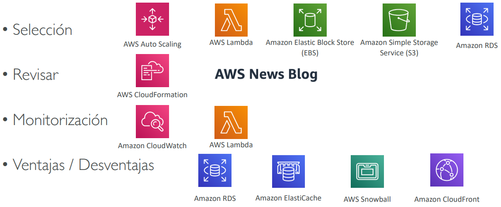

## 5) Optimización de costes
- Incluye la capacidad de **ejecutar sistemas para ofrecer valor empresarial al precio más bajo**.
- **Principios de diseño:**
  - **Adopta un modo de consumo** — Paga sólo por lo que usas.
  - **Medir la eficiencia global** — Utilizar CloudWatch.
  - **Deja de gastar dinero en las operaciones del centro de datos** — AWS se encarga de la parte de la infraestructura y permite al cliente centrarse en los proyectos de la organización.
  - **Analiza y atribuye el gasto** — La identificación precisa del uso y los costes del sistema ayuda a medir el retorno de la inversión (ROI). Asegúrate de utilizar etiquetas.
  - **Utiliza servicios gestionados y a nivel de aplicación para reducir el coste de propiedad** — Como los servicios gestionados operan a escala del Cloud, pueden ofrecer un menor coste por transacción o servicio.

### Servicios AWS - Optimización de costes
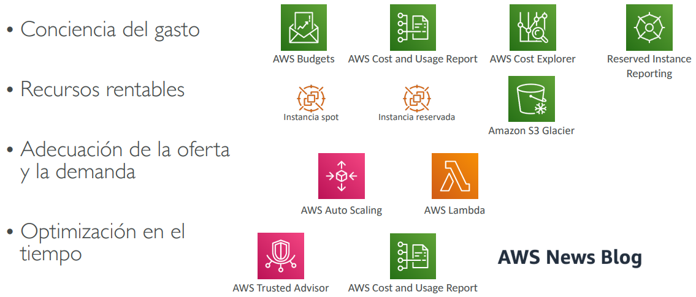

## 6) Sostenibilidad
- El pilar de la sostenibilidad se centra en minimizar el impacto medioambiental de la ejecución de cargas de trabajo en el Cloud.
- Principios de diseño
  - **Comprende tu impacto** - establece indicadores de rendimiento, evalúa las mejoras
  - **Establece objetivos de sostenibilidad** - Establece objetivos a largo plazo para cada carga de trabajo, modela el retorno de la inversión (ROI)
  - **Maximizar la utilización** - Dimensionar correctamente cada carga de trabajo para maximizar la eficiencia energética del hardware subyacente y minimizar los recursos ociosos.
  - **Anticipa y adopta nuevas ofertas de hardware y software más eficientes** - y diseña la flexibilidad para adoptar nuevas tecnologías con el tiempo.
  - **Utiliza servicios gestionados** - los servicios compartidos reducen la cantidad de infraestructura; los servicios gestionados ayudan a automatizar las mejores prácticas de sostenibilidad, como mover los datos a los que se accede con poca frecuencia al almacenamiento en frío y ajustar la capacidad de computación.
  - **Reduce el impacto descendente de tus cargas de trabajo en el Cloud** - Reduce la cantidad de energía o recursos necesarios para utilizar tus servicios y reduce la necesidad de que tus clientes actualicen sus dispositivos

### Servicios AWS - Sostenibilidad
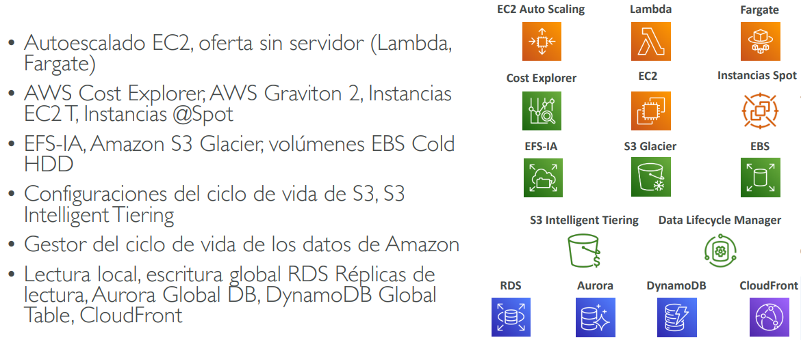

## [Herramienta AWS Well-Architected](https://console.aws.amazon.com/wellarchitected)
- Herramienta gratuita para revisar tus arquitecturas con respecto al Marco de los 6 pilares de la buena arquitectura y adoptar las mejores prácticas de arquitectura
- ¿Cómo funciona?
- Selecciona tu carga de trabajo y responde a las preguntas
- Revisa tus respuestas con respecto a los 6 pilares
- Obtén asesoramiento: obtén vídeos y documentación, genera un informe, ve los resultados en un
dashboards

## [AWS Customer Carbon Footprint Tool](https://aws.amazon.com/es/blogs/aws/new-customer-carbon-footprint-tool)
- Realiza seguimiento, medición, revisión y proyección de las emisiones de carbono generadas por tu uso de AWS
- Te ayuda a cumplir tus propios objetivos de sostenibilidad

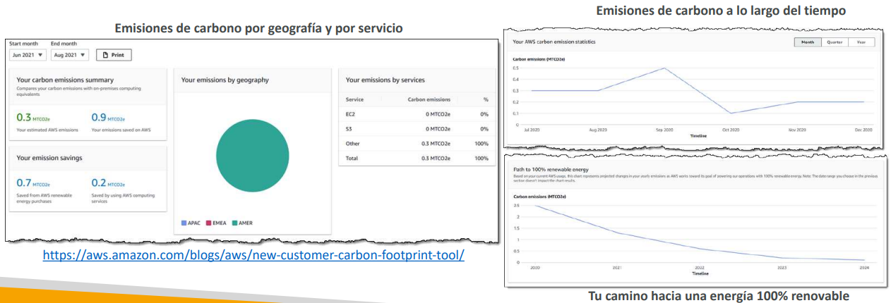

## [AWS Cloud Adoption Framework (AWS CAF)](https://aws.amazon.com/cloud-adoption-framework/)
- Te ayuda a construir y luego ejecutar un plan integral para tu transformación digital mediante el uso innovador de AWS
- Creado por profesionales de AWS aprovechando las mejores prácticas de AWS y las lecciones aprendidas de miles de clientes
- AWS CAF identifica las capacidades organizativas específicas que apuntalan el éxito de las transformaciones en el Cloud
- AWS CAF agrupa sus capacidades en seis perspectivas: Negocio, Personas, Gobierno, Plataforma, Seguridad y Operaciones

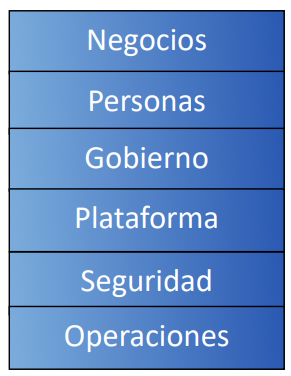

### Perspectivas y capacidades fundamentales del CAF Capacidades empresariales
- **Perspectiva empresarial** ayuda a garantizar que tus inversiones en el Cloud aceleran tus ambiciones de transformación digital y los resultados empresariales.
- **Perspectiva de las personas** sirve **como puente entre la tecnología y la empresa**, acelerando el viaje en el Cloud para ayudar a las organizaciones a evolucionar más rápidamente hacia una cultura de crecimiento continuo, aprendizaje y en la que el cambio se convierte en algo normal, centrándose en la cultura, la estructura organizativa, el liderazgo y el personal.
- **Perspectiva de gobierno** te ayuda a orquestar tus iniciativas en el Cloud maximizando los beneficios organizativos y minimizando los riesgos relacionados con la transformación.

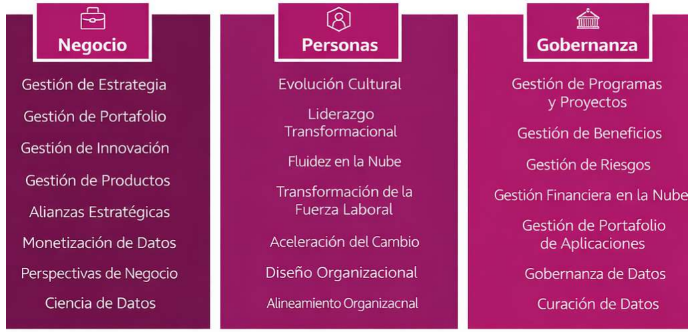

### Perspectivas y capacidades fundamentales del CAF Capacidades técnicas
- **Perspectiva de la plataforma** te ayuda a crear una plataforma de Cloud híbrida, escalable y de calidad empresarial, a modernizar las cargas de trabajo existentes y a implantar nuevas soluciones nativas de Cloud.
- **Perspectiva de seguridad** te ayuda a conseguir la confidencialidad, integridad y disponibilidad de tus datos y cargas de trabajo en el Cloud.
- **Perspectiva de las operaciones** ayuda a garantizar que tus servicios en el Cloud se prestan a un nivel que satisface las necesidades de tu empresa.

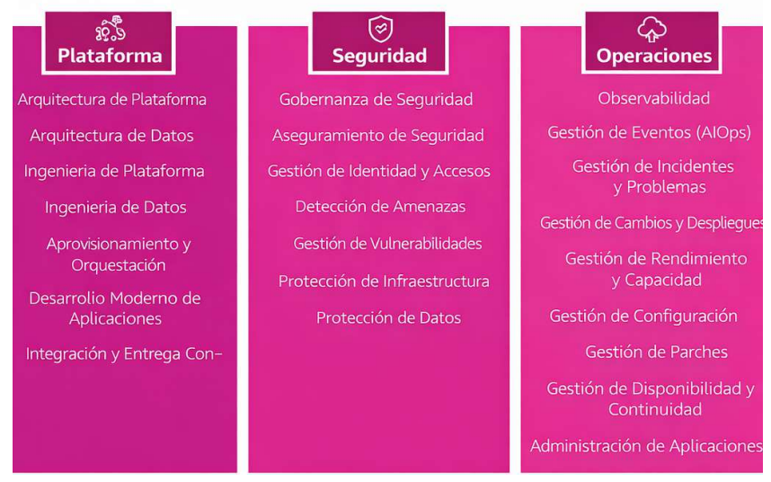

### Cadena de valor de la transformación Cloud
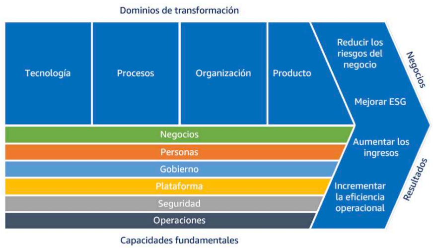

### AWS CAF - Dominios de transformación
- **Tecnología** - utilizar el Cloud para migrar y modernizar la infraestructura heredada, las aplicaciones, los datos y las plataformas de análisis...
- **Proceso** - digitalizando, automatizando y optimizando tus operaciones empresariales
  - aprovechar las nuevas plataformas de datos y análisis para crear perspectivas procesables
  - utilizando Machine Learning (ML) para mejorar tu experiencia de servicio al cliente...
- **Organización** - Reimaginando tu modelo operativo
  - organizar tus equipos entorno a productos y flujos de valor
  - aprovechando métodos ágiles para iterar y evolucionar rápidamente
- **Producto** - Reimaginar tu modelo de negocio creando nuevas propuestas de valor (productos y servicios) y modelos de ingresos

### AWS CAF - Fases de transformación
- **Envision:** demuestra cómo la nube acelerará los resultados del negocio al identificar oportunidades de transformación y crear una base para tu transformación digital
- **Align:** identifica brechas de capacidades en las 6 perspectivas de AWS CAF, lo que da como resultado un plan de acción
- **Launch:** construye y entrega iniciativas piloto en producción y demuestra valor de negocio incremental
- **Scale:** expande las iniciativas piloto a la escala deseada mientras obtienes los beneficios de negocio esperados

## Dimensionamiento correcto de AWS
- EC2 tiene muchos tipos de instancia, pero elegir el tipo de instancia más potente no es la mejor opción, porque el Cloud es **elástico**
- El dimensionamiento correcto es el proceso de adecuar los tipos y tamaños de instancia a los requisitos de rendimiento y capacidad de tu carga de trabajo al menor coste posible
- **Aumentar la escala es fácil, así que empieza siempre con algo pequeño**
- También es el proceso de examinar las instancias desplegadas e identificar las oportunidades de eliminar o reducir su tamaño sin comprometer la capacidad u otros requisitos, lo que da lugar a una reducción de los costes
- Es importante dimensionar correctamente...
  - **antes de una migración al Cloud**
  - **continuamente después del proceso de incorporación al Cloud (los requisitos cambian con el tiempo)**
- CloudWatch, Cost Explorer, Trusted Advisor y herramientas de terceros pueden ayudar

## Ecosistema AWS - Recursos gratuitos
- [**Blogs de AWS**](https://aws.amazon.com/blogs/aws/)
- [**Foros (comunidad) de AWS**](https://forums.aws.amazon.com/index.jspa)
- [**Whitepapers y guías de AWS**](https://aws.amazon.com/whitepapers)
- [**Inicio rápido de AWS**](https://aws.amazon.com/quickstart/)
  - Despliegues automatizados y de calidad en el Cloud de AWS
  - Construye tu entorno de producción rápidamente con plantillas
  - Ejemplo: [WordPress en AWS](https://fwd.aws/P3yyv?did=qs_card&trk=qs_card)
  - Aprovecha CloudFormation
- [**Soluciones AWS**](https://aws.amazon.com/solutions/)
  - Soluciones tecnológicas vetadas para el Cloud de AWS
  - Ejemplo - AWS Landing Zone: entorno AWS seguro y multicuenta
    - [https://aws.amazon.com/solutions/implementations/aws-landing-zone/](https://aws.amazon.com/solutions/implementations/aws-landing-zone/)
    - "Sustituido" por AWS Control Tower

## Ecosistema AWS - [AWS Support](https://aws.amazon.com/premiumsupport/)
- **DEVELOPER**
  - Acceso por correo electrónico en horario laboral a los asociados de soporte de Cloud
  - Orientación general: < 24 horas laborables
  - Sistema deteriorado: < 12 horas laborables
- **BUSINESS**
  - Acceso telefónico, por correo electrónico y por chat 24x7 a los ingenieros de soporte de Cloud
  - Sistema de producción deteriorado: < 4 horas
  - Sistema de producción averiado: < 1 hora
- **ENTERPRISE**
  - Acceso a un Gestor Técnico de Cuentas (TAM)
  - Equipo de soporte de atención (para la facturación y las mejores prácticas de la cuenta)
  - Caída del sistema crítico para el negocio < 15 minutos

> [!TIP]
> **Sugerencia de examen:** las dos pistas clave para distinguir los planes:
> - **TAM (Technical Account Manager)** → solo en **Enterprise** (y Enterprise On-Ramp).
> - **Tiempos de respuesta para sistema crítico caído:** Business **< 1h**, Enterprise **< 15 min**.
> - Si la pregunta menciona **acceso 24/7 por teléfono/chat**, ya descarta Developer.

## [AWS Marketplace](https://aws.amazon.com/marketplace)
- Catálogo digital con miles de listados de software de **proveedores de software independientes** (3ª parte)
- Ejemplo:
  - AMI personalizada (SO personalizado, firewalls, soluciones técnicas...)
  - Plantillas de CloudFormation
  - Software como servicio
  - Contenedores
- Si compras a través de AWS Marketplace, se incluye en tu factura de AWS
- Puedes **vender tus propias soluciones** en AWS Marketplace

> [!TIP]
> **Sugerencia de examen:** **software de terceros** (AMIs, contenedores, SaaS, plantillas CFN) en una sola factura junto con AWS → **AWS Marketplace**.

## [AWS Training](https://aws.amazon.com/training/)
- Formación digital (online) y presencial de AWS (presencial o virtual)
- Formación privada de AWS (para tu organización)
- Formación y certificación para el Gobierno de EE.UU.
- Formación y certificación para la empresa
- Academia AWS: ayuda a las universidades a enseñar AWS
- Y tu profesor online favorito… enseñándote todo sobre las certificaciones de AWS y mucho más!! :)

## [AWS Professional Services](https://aws.amazon.com/professional-services/) y Partner Network
- La organización de servicios profesionales de AWS es un equipo global de expertos
- Trabajan junto a tu equipo y a un miembro elegido de la APN
- APN = AWS Partner Network (Red de Socios de AWS)
- **Socios tecnológicos de APN**: proporcionan hardware, conectividad y software
- **Socios de consultoría de APN**: empresa de servicios profesionales para ayudar a construir en AWS
- **Socios de formación de APN**: encuentra quién puede ayudarte a aprender AWS
- **Programa de competencias de AWS**: las competencias de AWS se conceden a los socios de APN que han demostrado su competencia técnica y el éxito probado de sus clientes en áreas de soluciones especializadas
- **AWS Navigate Program**: ayuda a los socios a convertirse en mejores partners

> [!TIP]
> **Sugerencia de examen:** si la pregunta menciona un **equipo experto de AWS que trabaja contigo en un proyecto grande/enterprise** (migraciones complejas, arquitecturas a medida) → **AWS Professional Services**. Si menciona **socios externos certificados** (consultoras, fabricantes de hardware/software, formadores) → **APN (AWS Partner Network)**.

## [AWS IQ](https://aws.amazon.com/iq/)
- Encuentra rápidamente ayuda profesional para tus proyectos de AWS
- Contrata y paga a expertos de terceros certificados por AWS para trabajar en proyectos bajo demanda
- Videoconferencia, gestión de contratos, colaboración segura, facturación integrada

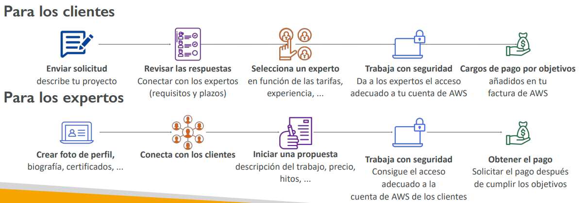

> [!TIP]
> **Sugerencia de examen:** contratar **expertos certificados de AWS bajo demanda** (proyectos cortos, pago integrado en factura) → **AWS IQ**. No lo confundas con **AWS Professional Services** (equipo grande de AWS para proyectos enterprise) ni con **APN Partners** (red de socios consultores).

## [AWS re:Post](https://repost.aws/es/knowledge-center)
- **Servicio de preguntas y respuestas gestionado por AWS** que ofrece respuestas a tus preguntas técnicas sobre AWS, revisadas por expertos y que sustituye a los foros originales de AWS
- Forma parte de la capa gratuita de AWS
- Los miembros de la comunidad pueden ganar puntos de reputación para aumentar su estatus de experto de la comunidad proporcionando respuestas aceptadas y revisando las respuestas de otros usuarios
- **Las preguntas de los clientes de AWS Premium Support que no reciben respuesta de la comunidad se transmiten a los ingenieros de AWS Support**
- AWS re:Post no está destinado a ser utilizado para preguntas que son sensibles al tiempo o que impliquen cualquier información de propiedad

> [!TIP]
> **Sugerencia de examen:** comunidad **Q&A** revisada por expertos AWS, **gratuita**, sustituye a los foros antiguos → **AWS re:Post**. No es para preguntas urgentes ni información sensible.

## [AWS Managed Services (AMS)](https://aws.amazon.com/managed-services/)
- Proporciona soporte de infraestructuras y aplicaciones en AWS.
- **AMS ofrece un equipo de expertos en AWS** que gestionan y operan tu infraestructura para garantizar la seguridad, fiabilidad y disponibilidad.
- Ayuda a las organizaciones a descargar las tareas rutinarias de gestión y centrarse en sus objetivos empresariales.
- Servicio totalmente gestionado, por lo que AWS se encarga de actividades comunes como peticiones de cambios, monitorización, gestión de parches, seguridad y servicios de backup
- Implementa las mejores prácticas y mantiene tu infraestructura de AWS para reducir tu sobrecarga operativa y el riesgo
- El horario comercial de AMS es 24/365

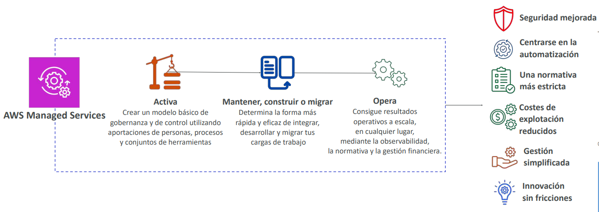

> [!TIP]
> **Sugerencia de examen:** **AWS opera y gestiona tu infraestructura en producción** (parches, monitorización, backups, cambios) para que te enfoques en tu negocio → **AWS Managed Services (AMS)**. Distinción: AMS *opera*, ProServ *construye/migra*, AWS IQ *contrata expertos sueltos*.

