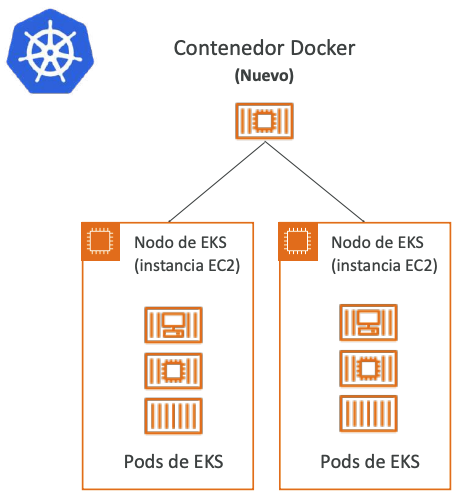

[](../7_DB/README.md)
[](../README.md)
[](../9_Deploy_&_Infra/README.md)

# Otros Servicios de Computación
## [ECS - Elastic Container Service](https://aws.amazon.com/ecs)
- ECS = Elastic Container Service
- Lanzar contenedores Docker en AWS
- **Se debe aprovisionar y mantener la infraestructura (las instancias EC2)**
- AWS se encarga de iniciar/parar los contenedores
- Tiene integraciones con el Application Load Balancer


## [Fargate](https://aws.amazon.com/fargate/)
- Lanza contenedores Docker en AWS
- **No hay que aprovisionar** la infraestructura (no hay instancias EC2 que gestionar) - ¡más sencillo!
- Oferta **serverless**
- AWS sólo ejecuta los contenedores en función de la CPU / RAM deseada


## [ECR - Elastic Container Registry](https://aws.amazon.com/ecr/)
- Registro privado de Docker en AWS
- **Almacenamiento de imágenes Docker** para que puedan ser ejecutadas por ECS o Fargate

## ¿Qué es Serverless?
- Serverless es un nuevo paradigma en el que los desarrolladores ya no tienen que gestionar servidores...
- Sólo despliegan código
- Sólo despliegan... ¡funciones!
- Inicialmente... Serverless == FaaS (Función como servicio)
- Serverless fue pionero por AWS Lambda, pero ahora también incluye todo lo que se gestiona "bases de datos, mensajería, almacenamiento, etc."
- Serverless no significa que no haya servidores... significa que simplemente el usuario no los gestiona / aprovisiona / ni ve

## [Amazon EKS](https://aws.amazon.com/eks)
- EKS = Elastic Kubernetes Service
- Te permite lanzar clústeres de Kubernetes administrados en AWS
- Kubernetes es un sistema de código abierto para la **administración, despliegue y escalado** de aplicaciones en contenedores (Docker)
- Los contenedores pueden alojarse en:
  - Instancias EC2
  - Fargate (Serverless)
- **Kubernetes es agnóstico de la nube** (puede usarse en cualquier nube: Azure, GCP...)



> [!TIP]
> **Sugerencia de examen — familia de contenedores (confusión clásica):**
> - **ECS:** ejecutar contenedores Docker — **tú aprovisionas las EC2** subyacentes.
> - **Fargate:** ejecutar contenedores Docker **sin gestionar EC2** (serverless).
> - **ECR:** **registro privado** de imágenes Docker (el "Docker Hub" de AWS).
> - **EKS:** **Kubernetes** gestionado — palabra gatillo: *Kubernetes* o *agnóstico de la nube*.

## [Lambda](https://aws.amazon.com/lambda)
### ¿Por qué Lambda?
**EC2:**
- Servidores virtuales en el Cloud
- Limitado por la RAM y la CPU
- Funcionamiento continuo
- Escalar significa intervenir para añadir/quitar servidores

**Lambda**
- **Funciones** virtuales: ¡no hay servidores que gestionar!
- Limitado por el tiempo - **ejecuciones cortas**
- Ejecución **bajo demanda**
- **El escalado está automatizado**

### Beneficios de AWS Lambda
- Precios sencillos:
- Paga por solicitud y tiempo de computación
    - Capa gratuita de 1.000.000 de solicitudes de AWS Lambda y 400.000 GB de tiempo de computación
    - Integrado con todo el conjunto de servicios de AWS
- **Dirigido por eventos:** las funciones son invocadas por AWS cuando se necesitan
- Integrado con muchos lenguajes de programación
- Fácil monitorización a través de AWS CloudWatch
- Fácil de obtener más recursos por funciones (¡hasta 10 GB de RAM!)
- ¡El aumento de la RAM también mejorará la CPU y la red!

### Soporte del lenguaje AWS Lambda
```
- Node.js (JavaScript)
- Python
- Java (compatible con Java 8)
- C# (.NET Core)
- Golang
- C# / Powershell
- Ruby
- API de tiempo de ejecución personalizado (compatible con la comunidad, ejemplo Rust)
```
### Imagen del contenedor Lambda
- La imagen del contenedor debe implementar la API de tiempo de ejecución Lambda
- Se prefiere ECS / Fargate para ejecutar imágenes Docker arbitrarias

### Lambda Ejemplo: Creación de miniaturas Serverless


### Lambda Ejemplo: Trabajo CRON Serverless


### Precios de AWS Lambda: ejemplo
[](https://aws.amazon.com/lambda/pricing)

Pago por **llamadas**:
- Los primeros 1.000.000 de solicitudes son gratuitos
- 0,20 $ por cada millón de solicitudes a partir de entonces (0,0000002 $ por solicitud)

Pago por **duración**: (en incrementos de 1 ms)
- 400.000 GB-segundos de tiempo de cálculo al mes GRATIS
- == 400.000 segundos si la función es de 1GB de RAM
- == 3.200.000 segundos si la función es de 128 MB de RAM
- Después, 1 dólar por 600.000 GB-segundos

***Suele ser muy barato ejecutar AWS Lambda, por lo que es muy popular***

> [!TIP]
> **Sugerencia de examen:** siempre que la pregunta mencione **funciones serverless dirigidas por eventos**, **ejecuciones cortas (máx. 15 min)** o **pago por invocación + duración**, piensa en **AWS Lambda**. Palabras gatillo: *event-driven, FaaS, sin servidores que gestionar*.

## [Amazon API Gateway](https://aws.amazon.com/api-gateway)
- Servicio totalmente gestionado para que los desarrolladores puedan crear, publicar, mantener, supervisar y asegurar fácilmente las API
- **Serverless** y **escalable**
- Soporta APIs RESTful y APIs WebSocket
- Soporta seguridad, autenticación de usuarios, claves de la API, monitorización...

> [!TIP]
> **Sugerencia de examen:** siempre que pregunten por **crear, publicar o gestionar APIs REST/WebSocket** de forma **serverless** (típicamente exponiendo Lambdas como HTTP), piensa en **Amazon API Gateway**.

### Ejemplo: construir una API serverless


## [AWS Batch](https://aws.amazon.com/batch)
- **Procesamiento por lotes** totalmente gestionado **a cualquier escala**
- Ejecuta eficientemente 100.000 trabajos de computación por lotes en AWS
- Un trabajo "por lotes" es un trabajo con un inicio y un final (en contraposición a uno continuo)
- Batch lanzará dinámicamente **instancias EC2 o instancias Spot**
- AWS Batch proporciona la cantidad adecuada de computación / memoria
- Tú envías o programas los trabajos por lotes y AWS Batch se encarga del resto
- Los trabajos por lotes se definen como **imágenes Docker** y **se ejecutan en ECS**
- Útil para optimizar los costes y centrarse menos en la infraestructura

### Batch - Ejemplo simplificado


## Batch vs Lambda
**Lambda:**
- Límite de tiempo
- Tiempos de ejecución limitados
- Espacio de disco temporal limitado
- Serverless

**Por lotes:**
- Sin límite de tiempo
- Cualquier tiempo de ejecución siempre que esté empaquetado como imagen Docker
- Depende de EBS / almacén de instancias para el espacio en disco
- Depende de EC2 (puede ser gestionado por AWS)

> [!TIP]
> **Sugerencia de examen — Batch vs Lambda:**
> - **Lambda:** ejecuciones **cortas (≤15 min)**, **serverless**, sin Docker arbitrario, ideal para event-driven.
> - **AWS Batch:** **trabajos por lotes** con inicio y fin definidos, **sin límite de tiempo**, corre en **EC2/Spot** y se definen como **imágenes Docker en ECS**. Palabra gatillo: *batch jobs, procesamiento por lotes a gran escala*.

## [Amazon Lightsail](https://aws.amazon.com/lightsail)
- Servidores virtuales, almacenamiento, bases de datos y redes
- Precios bajos y predecibles
- Alternativa más sencilla al uso de EC2, RDS, ELB, EBS, Route 53...
- Ideal para personas con **poca experiencia en el Cloud**
- Puedes configurar notificaciones y monitorización de tus recursos Lightsail
- Tiene alta disponibilidad pero no tiene autoescalado, integraciones limitadas con AWS

> *Casos de uso:*
> - Aplicaciones web sencillas (tiene plantillas para LAMP, Nginx, MEAN, Node.js...)
> - Sitios web (plantillas para WordPress, Magento, Plesk, Joomla)
> - Entorno de desarrollo/prueba

> [!TIP]
> **Sugerencia de examen:** si la pregunta menciona **principiantes en el Cloud**, **precios bajos y predecibles** o plantillas listas (WordPress, LAMP, Magento), piensa en **Amazon Lightsail** — alternativa simplificada a EC2/RDS/ELB sin autoescalado.

## Resumen
- **Docker:** tecnología de contenedores para ejecutar aplicaciones
- **ECS:** ejecuta contenedores Docker en instancias EC2
- **Fargate:**
    - Ejecuta contenedores Docker sin aprovisionar la infraestructura
    - Oferta serverless (sin instancias EC2)
- **ECR:** Repositorio privado de imágenes Docker
- **EKS:** ejecuta clústeres de Kubernetes administrados en AWS (agnóstico de la nube)
- **Batch:** ejecuta trabajos por lotes en AWS a través de instancias EC2
gestionadas
- **Lightsail:** precios predecibles y bajos para pilas de aplicaciones y bases de datos sencillas

## Resumen - Lambda
- Lambda es serverless, función como servicio, escalado sin fisuras, reactivo
- **Facturación de Lambda:**
    - Por el tiempo de ejecución x por la RAM aprovisionada
    - Por el número de invocaciones
- **Soporte de lenguajes:** muchos lenguajes de programación excepto (arbitrariamente) Docker
- **Tiempo de invocación:** hasta 15 minutos

> *Casos de uso:*
> - Crear miniaturas para imágenes subidas a S3
> - Ejecutar un trabajo cron sin servidor
> - Gateway de la API: exponer las funciones Lambda como API HTTP

[](../7_DB/README.md)
[](../README.md)
[](../9_Deploy_&_Infra/README.md)