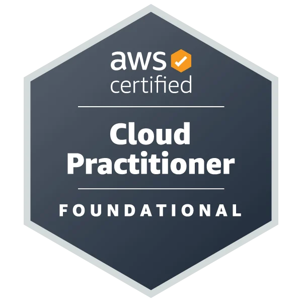
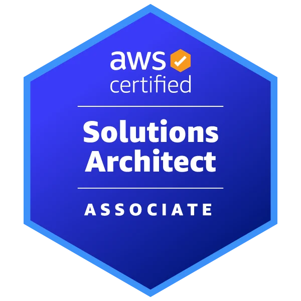

# Apuntes de certificaciones AWS

Repositorio de apuntes y recursos de estudio para certificaciones AWS.

## Certificaciones

  
  &nbsp;&nbsp;&nbsp;
  

| Certificación | Nivel | Apuntes |
|---|---|---|
| **AWS Certified Cloud Practitioner (CCP)** | Foundational | [Ver apuntes](./CCP/README.md) |
| **AWS Certified Solutions Architect – Associate (SAA)** | Associate | [Ver apuntes](./SAA/README.md) |
