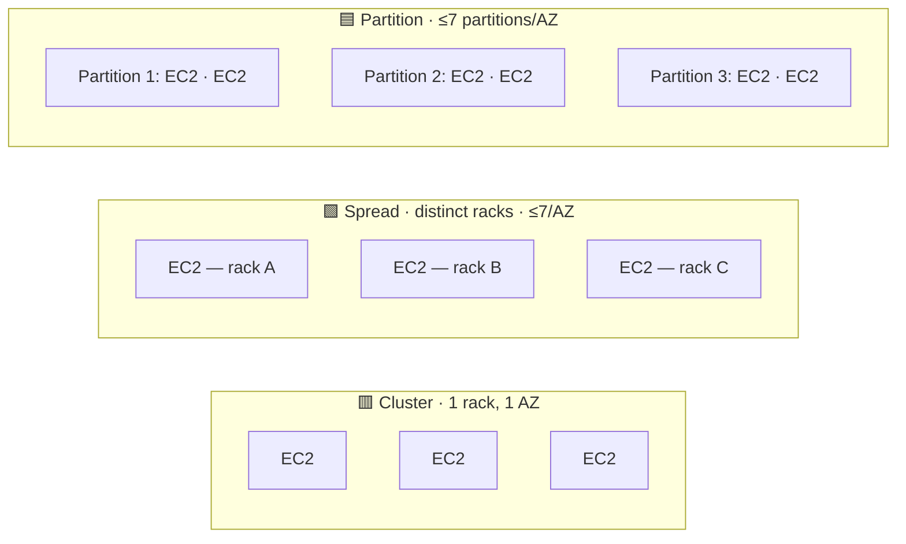

# EC2 Placement Groups

> **Pitch (1 line):** you control *where* AWS places your instances on the hardware to optimize **latency** (Cluster), **isolation** (Spread), or **fault tolerance for distributed apps** (Partition).

## 🎯 When the exam picks this

- "lowest latency / highest network throughput between instances" → **Cluster**
- "critical instances that must NOT share hardware" → **Spread**
- "large distributed app like HDFS / HBase / Cassandra / Kafka" → **Partition**

## 🧠 Core (non-obvious bits)

- **Cluster** = same AZ, same rack. 10 Gbps between instances, but if the rack fails → they ALL go down. Concentrated risk in exchange for performance.
- **Spread** = each instance on distinct hardware (rack). Maximum fault **isolation**, but a hard cap on instance count.
- **Partition** = groups of racks ("partitions") isolated from each other; AWS exposes which partition each instance is in (partition-aware). Scales to hundreds of instances.
- You can **move** an instance in/out of a placement group, but it must be **stopped** (via CLI/SDK).
- For Cluster, launch all instances of the **same type and all at once** to avoid insufficient-capacity errors.

## 🔢 Numbers to memorize

- **Spread:** max **7 instances per AZ** per placement group.
- **Partition:** max **7 partitions per AZ**.
- Cluster: use instance types that support **Enhanced Networking** to reach the high bandwidth.

## ⚠️ Common traps

- "low latency AND high availability" → ⚠️ Cluster gives latency but NOT HA (single rack). If they require both, spread across AZs (not a pure Cluster group).
- "few critical instances, each isolated" → **Spread** (not Partition).
- "many instances, app that already replicates data" → **Partition** (Spread falls short due to the 7-instance cap).

## 🔄 Easily confused with

- → [Cluster vs Spread vs Partition](../../comparativas/cluster-spread-partition.md)

## 🖼️ Diagram

<!-- Prefer the course slide? Save the screenshot to ../../assets/placement-groups.png
     and replace the mermaid block above with:
      -->

---

