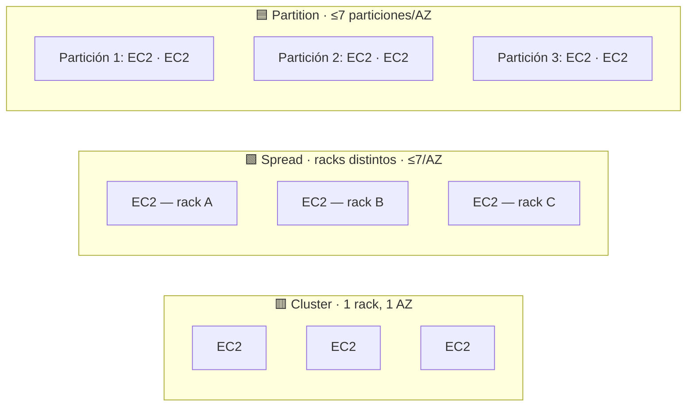

# EC2 Placement Groups

> **Pitch (1 line):** controlas *dónde* coloca AWS tus instancias en el hardware para optimizar **latencia** (Cluster), **aislamiento** (Spread) o **tolerancia a fallos de apps distribuidas** (Partition).

## 🎯 When the exam picks this

- "lowest latency / highest network throughput between instances" → **Cluster**
- "instancias críticas que NO deben compartir hardware" → **Spread**
- "app distribuida grande tipo HDFS / HBase / Cassandra / Kafka" → **Partition**

## 🧠 Core (non-obvious bits)

- **Cluster** = misma AZ, mismo rack. 10 Gbps entre instancias, pero si cae el rack → caen todas. Riesgo concentrado a cambio de rendimiento.
- **Spread** = cada instancia en hardware (rack) distinto. Máximo **aislamiento** de fallos, pero límite duro de instancias.
- **Partition** = grupos de racks ("particiones") aislados entre sí; AWS expone en qué partición está cada instancia (partition-aware). Escala a cientos de instancias.
- Puedes **mover** una instancia dentro/fuera de un placement group, pero debe estar **detenida** (vía CLI/SDK).
- Para Cluster, lanza todas las instancias del **mismo tipo y de una vez** para evitar errores de capacidad insuficiente.

## 🔢 Numbers to memorize

- **Spread:** máximo **7 instancias por AZ** por placement group.
- **Partition:** máximo **7 particiones por AZ**.
- Cluster: recomendado tipos que soporten **Enhanced Networking** para alcanzar el ancho de banda alto.

## ⚠️ Common traps

- "necesito baja latencia Y alta disponibilidad" → ⚠️ Cluster da latencia pero NO HA (single rack). Si exigen ambas, repártelo en varias AZ (no es Cluster puro).
- "pocas instancias críticas, cada una aislada" → **Spread** (no Partition).
- "muchas instancias, app que ya replica datos" → **Partition** (Spread se queda corto por el límite de 7).

## 🔄 Easily confused with

- → [Cluster vs Spread vs Partition](../../comparativas/cluster-spread-partition.md) *(crear si aún no existe)*

## 🖼️ Diagram

<!-- ¿Prefieres el slide del curso? Guarda el screenshot en ../../assets/placement-groups.png
     y reemplaza el bloque mermaid de arriba por:
      -->

---

