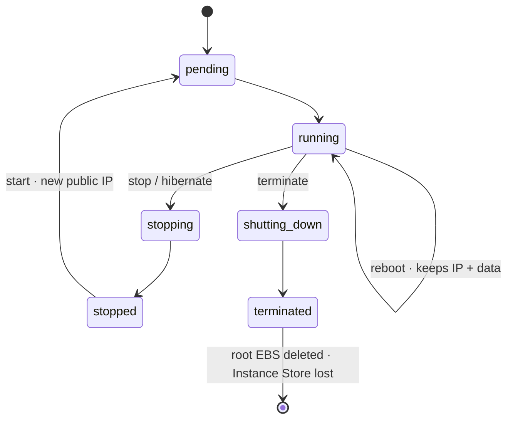

# EC2 Instance Lifecycle & Data Persistence

> **Pitch (1 line):** what happens to your **data and IP** across **reboot / stop / hibernate / terminate** — the source of the classic "it restarted and lost the data" trap.

## 🎯 When the exam picks this

- "the instance stopped/terminated and the data was lost" → it was **Instance Store** (ephemeral)
- "prevent accidental termination" → **Termination Protection**
- "the public IP changed after stop/start" → public IPv4 is NOT static (use an **Elastic IP**)

## 🧠 Core (non-obvious bits)

- **Reboot ≠ Stop.** Reboot keeps the SAME instance: it keeps the public IP, the EBS data **and** the Instance Store data. It is not a stop+start.
- **Stop/Start:** the instance may move to a **different physical host** (that's why Instance Store data is wiped — the local disks live on the old host). The **public IPv4 changes** (unless Elastic IP); the **private IP, Elastic IP and ENI all stay attached**. You don't pay for compute while `stopped`, but you **still pay for the EBS volumes**.
- **Terminate:** the **root EBS** volume is deleted by default (`DeleteOnTermination = true`); **additional EBS** volumes survive by default (`false`).
- **Instance Store** is ephemeral: it survives a **reboot**, but is lost on **stop, hibernate, terminate** or physical host failure. Never use it for data that must persist.
- **Hibernate** = a stop variant that saves RAM to the root EBS volume (preserves in-memory state, fast restart). Requirements and use cases → see the Hibernation card.
- **Termination Protection** blocks accidental `terminate` from console/CLI (does not affect stop).

## 🔢 Numbers to memorize

- `DeleteOnTermination`: **true** on the root, **false** on additional volumes (defaults).
- Instance Store: **0 persistence** across stop/terminate/host failure (survives reboot only).

## ⚠️ Common traps

- "lost data after stop/start but NOT after reboot" → **Instance Store** (the key tell vs EBS).
- "I need to keep the data volume when the instance is terminated" → set `DeleteOnTermination = false` on that volume.
- "the public IP changed and broke the config" → it wasn't an Elastic IP; public IPv4 is reassigned on every start.

## 🖼️ Diagram

## 🔄 Easily confused with

- → [Hibernation (requirements & use cases)](./04-hibernation.md)
- Storage persistence in depth → see block [02 — Storage for EC2](../02-storage-ec2/README.md)

---

