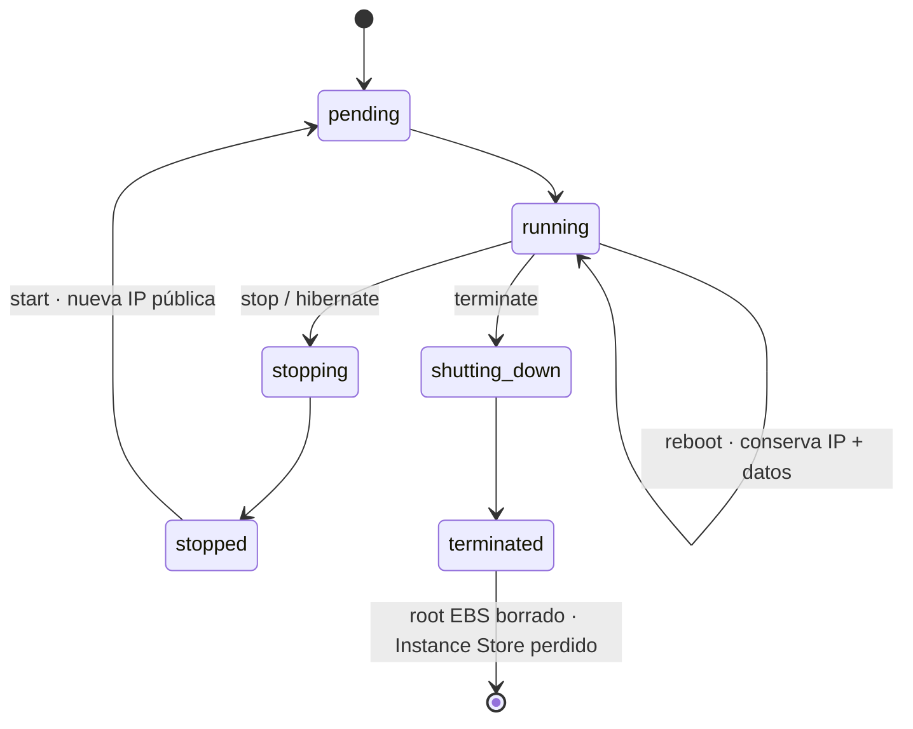

# EC2 Instance Lifecycle & Data Persistence

> **Pitch (1 line):** qué le pasa a tus **datos e IP** según hagas **reboot / stop / hibernate / terminate** — el origen de la trampa clásica "se reinició y perdió los datos".

## 🎯 When the exam picks this

- "la instancia se detuvo/terminó y se perdieron los datos" → era **Instance Store** (efímero)
- "evitar terminación accidental" → **Termination Protection**
- "al hacer stop/start cambió la IP pública" → IPv4 pública NO es fija (usa **Elastic IP**)

## 🧠 Core (non-obvious bits)

- **Reboot ≠ Stop.** Reboot mantiene la MISMA instancia: conserva IP pública, datos de EBS **y** de Instance Store. No es un stop+start.
- **Stop/Start:** la IPv4 **pública cambia** (salvo Elastic IP); la **privada se mantiene**. No pagas cómputo mientras está `stopped`, pero **sí sigues pagando los volúmenes EBS**.
- **Terminate:** el volumen **root EBS** se borra por defecto (`DeleteOnTermination = true`); los **volúmenes EBS adicionales** sobreviven por defecto (`false`).
- **Instance Store** es efímero: sobrevive un **reboot**, pero se pierde en **stop, hibernate, terminate** o fallo del host físico. Nunca lo uses para datos que deban persistir.
- **Hibernate** = variante de stop que guarda la RAM en el EBS root (preserva estado en memoria, arranque rápido). Requisitos y casos → ver card de Hibernation.
- **Termination Protection** bloquea el `terminate` accidental desde consola/CLI (no afecta a stop).

## 🔢 Numbers to memorize

- `DeleteOnTermination`: **true** en el root, **false** en volúmenes adicionales (por defecto).
- Instance Store: **0 persistencia** ante stop/terminate/host failure (solo sobrevive reboot).

## ⚠️ Common traps

- "perdió datos tras stop/start pero NO tras reboot" → **Instance Store** (clave para distinguirlo de EBS).
- "necesito conservar el volumen de datos al terminar la instancia" → poner `DeleteOnTermination = false` en ese volumen.
- "la IP pública cambió y rompió la config" → no era Elastic IP; la IPv4 pública se reasigna en cada start.

## 🖼️ Diagram

## 🔄 Easily confused with

- → [Hibernation (requisitos y casos)](./04-hibernation.md) *(card del bloque, crear)*
- Persistencia de almacenamiento a fondo → ver bloque [02 — Storage for EC2](../02-storage-ec2/README.md)

---

