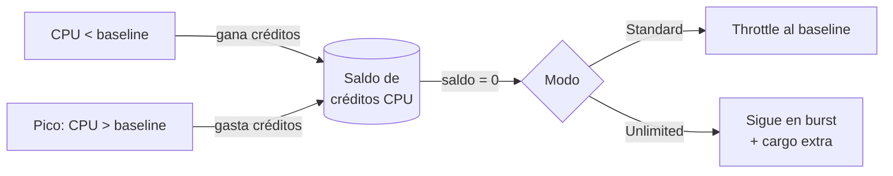

# Burstable Instances (T family) & CPU Credits

> **Pitch (1 line):** las instancias **T** (T2/T3/T3a/T4g) son baratas y dan un rendimiento **baseline** con capacidad de **burst** por encima usando **créditos de CPU** — ideales para cargas con picos esporádicos.

## 🎯 When the exam picks this

- "carga con picos esporádicos, CPU baja de media, sensible al costo" → **familia T (burstable)**
- "que pueda superar picos sin throttle aunque se acaben los créditos" → **T Unlimited mode**
- "CPU alta y sostenida" → ⚠️ NO uses T → **Compute Optimized (familia C)**

## 🧠 Core (non-obvious bits)

- Cada instancia T tiene un **baseline** de CPU (un % fijo). Por debajo del baseline **gana** créditos; al hacer burst por encima **gasta** créditos.
- **Standard mode:** si el saldo de créditos llega a 0 → la instancia queda **throttled al baseline** (la app se ralentiza).
- **Unlimited mode:** puede seguir en burst aunque se agoten los créditos, pero **se factura un extra** si el uso medio supera el baseline.
- Defaults importantes: **T2 = Standard** por defecto; **T3/T3a/T4g = Unlimited** por defecto.
- Caso de uso típico: servidores web, dev/test, microservicios, BD pequeñas — todo lo de **CPU media baja con picos puntuales**.

## 🔢 Numbers to memorize

- Métrica de CloudWatch a vigilar: **`CPUCreditBalance`** (si tiende a 0 bajo carga → te quedas sin créditos).
- El baseline depende del tamaño (ej. `t3.micro` ≈ 10% × 2 vCPU). No memorices los %; memoriza el **concepto** baseline/burst.

## ⚠️ Common traps

- "la app T2/T3 se vuelve lenta bajo carga sostenida" → se **agotaron los créditos** de CPU → activar **Unlimited** o migrar a **C** (compute optimized).
- "más barato para una carga CPU-intensiva constante" → ❌ T no; el throttle o el extra de Unlimited lo encarecen. Es para picos, no para carga plana alta.

## 🖼️ Diagram

## 🔄 Easily confused with

- → [Tipos de instancia / familias (CCP)](../../../CCP/3_EC2/README.md) — General Purpose vs Compute Optimized vs Memory/Storage.

---

