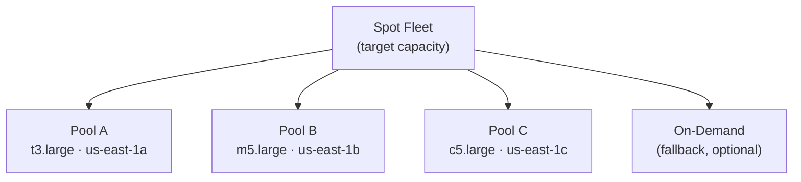

# Spot Instances, Spot Fleets & Spot Blocks

> **Pitch (1 line):** up to **90% cheaper** than On-Demand, but AWS can **reclaim** them with a 2-minute warning — designed for fault-tolerant, interruption-safe workloads.

## 🎯 When the exam picks this

- "cheapest compute, workload tolerates interruptions" → **Spot Instance**
- "mix Spot + On-Demand to meet a target capacity cost-effectively" → **Spot Fleet**
- "batch jobs / big data / CI workloads / image processing" → Spot (all interruption-tolerant)
- "need Spot but guaranteed for a fixed duration (1–6 h)" → **Spot Block** *(being deprecated — exam may still test it)*

## 🧠 Core (non-obvious bits)

- You set a **max price**. If the current Spot price exceeds it → instance is **interrupted** (2-min warning via instance metadata + EventBridge).
- **Interruption behaviors:** terminate (default) / stop / hibernate — you choose.
- **Spot Fleet** = a collection of Spot + (optionally) On-Demand requests. You define capacity pools (instance type + AZ combos) and a target capacity; the fleet picks the cheapest pool(s). Allocation strategies:
  - `lowestPrice` — pure cost, least resilient.
  - `diversified` — spread across pools, higher resilience.
  - `capacityOptimized` — picks the pool with most available capacity (fewest interruptions). Usually best for production.
- **Spot Instance Request types:**
  - `one-time` — fulfilled once, not replaced if interrupted.
  - `persistent` — automatically re-requests after interruption (until valid-until date).
- Spot instances **cannot be stopped** by the user when the request is `persistent` — you must cancel the request first, then terminate the instance.

## 🔢 Numbers to memorize

- Interruption warning: **2 minutes** before reclaim.
- Spot Block duration: **1 to 6 hours** (whole hours only).
- Max discount: up to **~90%** vs On-Demand.

## ⚠️ Common traps

- "need guaranteed capacity for a long-running critical workload" → NOT Spot → On-Demand or Reserved.
- "cancel a persistent Spot request but the instance keeps running" → cancelling the request alone doesn't terminate the instance — you must terminate it separately.
- "cheapest option for a database" → NOT Spot (databases can't tolerate interruptions).

## 🔄 Easily confused with

- → [Purchasing options (CCP)](../../../CCP/3_EC2/README.md) — On-Demand vs Reserved vs Savings Plan vs Dedicated

## 🖼️ Diagram

---

