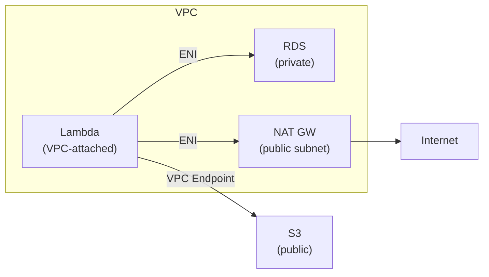

# Lambda in a VPC

> **Pitch (1 line):** by default Lambda runs outside your VPC and can't reach private resources — attaching it to a VPC gives private access at the cost of ENI provisioning and internet access loss.

## 🎯 When the exam picks this

- "Lambda needs to access RDS / ElastiCache / private EC2 in the VPC" → **Lambda + VPC**
- "Lambda in VPC needs to call DynamoDB / S3 (public AWS services)" → **VPC Endpoint or NAT Gateway**
- "Lambda in VPC has no internet access" → needs **NAT Gateway** in a public subnet

## 🧠 Core (non-obvious bits)

**Default (no VPC):**
- Lambda runs in an AWS-managed VPC with internet access. Can reach public AWS endpoints (S3, DynamoDB via public endpoints) and the internet directly.

**VPC-attached Lambda:**
- Lambda creates an **ENI (Elastic Network Interface)** in your private subnet. Function code runs in the Lambda-managed network but traffic enters/exits your VPC via the ENI.
- Can now reach **RDS, ElastiCache, internal ALBs** — anything in the VPC.
- **Loses internet access** — because it's in a private subnet with no route to IGW.
- To restore internet access: add a **NAT Gateway** in a public subnet with a route.
- To reach S3/DynamoDB without going through NAT (cheaper, private): add a **VPC Gateway Endpoint**.

**Scaling consideration:**
- Lambda creates one ENI per subnet per security group combo — at high concurrency, may exhaust available IPs in the subnet. Use a subnet with enough IPs.

## 🖼️ Diagram

## ⚠️ Common traps

- "Lambda can't reach S3 after attaching to VPC" → S3 is a public service; VPC-attached Lambda loses internet → add VPC Gateway Endpoint or NAT Gateway.
- ENI cold start: VPC-attached Lambda used to have longer cold starts. AWS now pre-provisions ENIs — this is largely a legacy concern.

---

