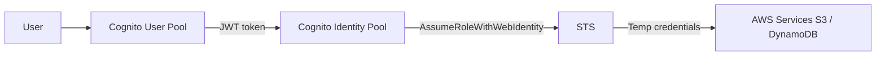

# Identity Federation — SAML, Web Identity & Cognito

> **Pitch (1 line):** federation lets external identities (corporate AD, Google, Facebook) access AWS without creating IAM users — map external tokens to IAM roles via STS.

## 🎯 When the exam picks this

- "corporate users (Active Directory / SAML 2.0) need AWS Console access without IAM users" → **SAML Federation**
- "mobile/web app users (Google, Facebook, Amazon, OIDC) need AWS resource access" → **Cognito / Web Identity Federation**
- "allow millions of unauthenticated or social-login users access to AWS" → **Cognito Identity Pools**

## 🧠 Core (non-obvious bits)

**SAML 2.0 Federation:**
- For corporate IdPs (Active Directory, Okta, etc.) that support SAML 2.0.
- Flow: User → IdP (authenticate) → SAML assertion → AWS STS `AssumeRoleWithSAML` → temp credentials → Console or API.
- AWS SSO / IAM Identity Center is the modern preferred approach (see card 05).

**Web Identity Federation (OIDC):**
- For mobile/web apps using public IdPs (Amazon, Google, Facebook, any OIDC provider).
- Flow: User → IdP (login) → JWT/OIDC token → AWS STS `AssumeRoleWithWebIdentity` → temp credentials.
- **Recommended approach:** use **Cognito** instead of calling STS directly (Cognito handles the complexity).

**Amazon Cognito:**
- **User Pools:** user directory — handles sign-up, sign-in, MFA, password reset. Returns JWT tokens. Does NOT give direct AWS access.
- **Identity Pools (Federated Identities):** exchanges any identity (Cognito User Pool token, social login, SAML, guest) for **temporary AWS credentials** via STS. Gives direct access to AWS services.
- Common pattern: User Pool (authenticate) + Identity Pool (authorize to AWS resources).

**Guest access (unauthenticated):**
- Cognito Identity Pools can issue limited credentials even to unauthenticated (guest) users — useful for read-only access to public content.

## Diagram

## ⚠️ Common traps

- Cognito **User Pools** ≠ **Identity Pools**: User Pools = authentication (who are you?); Identity Pools = AWS authorization (what can you do in AWS?).
- Don't call `AssumeRoleWithWebIdentity` directly in apps — use Cognito, which wraps this and adds security features.
- SAML federation requires a trust metadata exchange between AWS and the IdP.

---

