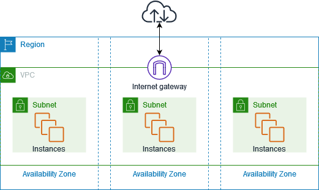

# VPC Foundations — Subnets, Route Tables, IGW, AZs

> **Pitch (1 line):** a VPC is your isolated virtual network in AWS — subnets carve it into public/private zones across AZs, route tables control traffic flow, and an Internet Gateway enables internet access.

## 🎯 When the exam picks this

- "isolate resources in a private network" → **VPC**
- "allow public internet access to a subnet" → **Internet Gateway + route 0.0.0.0/0 → IGW**
- "resources in multiple AZs for high availability" → **multiple subnets in different AZs**

## 🧠 Core (non-obvious bits)

**VPC basics:**
- **CIDR block:** define the IP range (e.g., `10.0.0.0/16`). Max /16, min /28. Cannot change after creation.
- One region per VPC, spans all AZs in that region.
- **Default VPC:** pre-created in every region, all subnets are public. Safe to use for quick testing.

**Subnets:**
- Subdivision of a VPC's CIDR. Each subnet is in exactly **one AZ**.
- **Public subnet:** route table has a route to an IGW — resources can communicate with internet (if they have a public IP).
- **Private subnet:** no route to IGW — only reachable from within the VPC or via VPN/Direct Connect.
- AWS reserves **5 IPs** per subnet (first 4 + last 1) — a /28 has 16 - 5 = 11 usable IPs.

**Internet Gateway (IGW):**
- One per VPC. Horizontally scaled, highly available, no bandwidth constraints.
- Enables two-way communication between VPC and internet.
- A subnet is only "public" if its route table points default traffic (`0.0.0.0/0`) to the IGW.

**Route Tables:**
- Each subnet is associated with exactly one route table (can share a single route table across subnets).
- **Main route table:** default for all subnets that don't have an explicit association.
- Routes are evaluated most-specific first (longest prefix match).

**Availability Zones:**
- Deploy across ≥ 2 AZs for high availability. Each AZ has independent power/networking/cooling.

## 🔢 Numbers to memorize

- Max VPC CIDR: **/16** (65,536 IPs), min: **/28** (16 IPs)
- Reserved IPs per subnet: **5**
- Max VPCs per region: **5** (soft limit, can increase)

## 📊 Diagram

*VPC con subnets públicas y privadas en múltiples AZs. El IGW conecta las subnets públicas al internet; las privadas no tienen ruta directa.*

## ⚠️ Common traps

- An IGW alone doesn't make a subnet public — the route table must also have a `0.0.0.0/0 → igw-xxx` route.
- A public IP on an EC2 instance is still not internet-accessible if the subnet has no IGW route.
- Subnets in the same VPC can communicate by default (local route) regardless of public/private classification.

---

