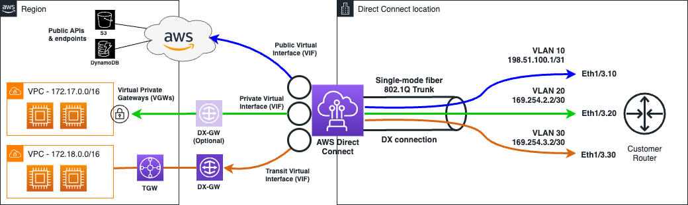

# Direct Connect (DX)

> **Pitch (1 line):** a dedicated private physical network connection from your data center to AWS — consistent bandwidth, low latency, no public internet, ideal for high-throughput or compliance workloads.

## 🎯 When the exam picks this

- "dedicated, private, consistent bandwidth connection from on-prem to AWS" → **Direct Connect**
- "large data transfers (TB/s), not over internet" → **Direct Connect**
- "compliance: traffic must not traverse the public internet" → **Direct Connect**
- "fast DR failover for Direct Connect" → **Direct Connect + Site-to-Site VPN backup**

## 🧠 Core (non-obvious bits)

**How it works:**
- Physical fiber connection at an **AWS Direct Connect location** (colocation facility). Your router (or a partner's) connects to AWS's router.
- Traffic never touches the public internet.
- You create **Virtual Interfaces (VIFs)** on top of the physical connection:
  - **Private VIF:** connects to a VPC via a VGW or TGW.
  - **Public VIF:** connects to AWS public services (S3, CloudFront) without going through the internet.
  - **Transit VIF:** connects to a Transit Gateway (handles many VPCs at once).

**Bandwidth options:**
- **Dedicated connection:** 1 Gbps, 10 Gbps, 100 Gbps — physical port provisioned at DX location.
- **Hosted connection (via partner):** 50 Mbps to 10 Gbps — partner shares capacity, faster to provision.

**Lead time:** weeks to months for provisioning. Not suitable for quick connectivity needs.

**Encryption:**
- DX itself is NOT encrypted (private, but not encrypted by default).
- To encrypt: run IPSec VPN **over** a Direct Connect public VIF → **MACsec** for dedicated connections.

**Direct Connect Gateway:**
- Connects one DX connection to **multiple VPCs in different regions** (global reach) without needing separate DX connections per region.

**Resiliency options:**
- Single DX connection = single point of failure. For HA: dual connections at one location, or connections at two DX locations.
- **Maximum resiliency:** two connections at each of two separate DX locations.
- **Failover pattern:** DX primary + Site-to-Site VPN backup (VPN activates if DX fails).

## 🔢 Numbers to memorize

- Dedicated: **1 / 10 / 100 Gbps**
- Hosted (partner): **50 Mbps – 10 Gbps**

## 📊 Diagram

*Private VIF → VGW → VPC. Public VIF → AWS public services (S3, etc.). Transit VIF → TGW → múltiples VPCs.*

## ⚠️ Common traps

- DX is NOT encrypted by default — add VPN or MACsec if encryption over the wire is required.
- DX provisioning takes weeks — not suitable for urgent connectivity. Use VPN first, then migrate to DX.
- "Private VIF" for VPC access; "Public VIF" for AWS public services (S3, etc.) — they use different BGP communities.

---

