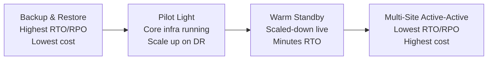

# Disaster Recovery Strategies

> **Pitch (1 line):** four DR tiers — Backup & Restore, Pilot Light, Warm Standby, Multi-Site — trade cost vs RPO/RTO: cheaper = slower recovery; more expensive = faster.

## 🎯 When the exam picks this

- "lowest cost DR, hours of RTO/RPO acceptable" → **Backup & Restore**
- "core services always running in DR region, scale up on disaster" → **Pilot Light**
- "scaled-down but fully functional DR environment, minutes RTO" → **Warm Standby**
- "zero downtime, identical active-active in two regions" → **Multi-Site / Hot Standby**
- "RTO < 1 minute / near-zero RPO" → **Multi-Site Active-Active**

## 🧠 Core (non-obvious bits)

**Key terms:**
- **RPO (Recovery Point Objective):** maximum acceptable data loss (how old can the backup be?).
- **RTO (Recovery Time Objective):** maximum acceptable downtime (how long to restore service?).

**The four strategies:**

| Strategy | RPO | RTO | Cost | Description |
|---|---|---|---|---|
| **Backup & Restore** | Hours | Hours | $ | Backups to S3/Glacier. Restore from scratch on disaster. |
| **Pilot Light** | Minutes | 10s of minutes | $$ | Core services (DB replica) always on. Scale out compute on DR. |
| **Warm Standby** | Seconds | Minutes | $$$ | Scaled-down but fully running copy in DR region. Scale up on disaster. |
| **Multi-Site / Hot** | Near-zero | Near-zero | $$$$ | Full-scale active-active in both regions. Route 53 distributes traffic. |

**AWS tools used in DR:**
- **Route 53:** health checks + failover routing policy for DNS-level failover.
- **Aurora Global Database:** sub-1-second replication, cross-region read replica → promote on DR.
- **RDS read replicas:** cross-region replication for relational DBs.
- **S3 Cross-Region Replication:** replicate backups to DR region.
- **CloudFormation / AMIs:** rebuild infrastructure in DR region quickly.

## ⚠️ Common traps

- "pilot light" = only the flame is on (minimal resources, not full environment). Compute must be started/scaled on DR event.
- "warm standby" = scaled-down version running — this is NOT the same as pilot light (which has no compute).
- Multi-site doesn't mean "both active by default" — it must be Active-Active architecture with load balancing.
- RPO and RTO are business requirements — the strategy is chosen to meet them at the lowest cost.

---

