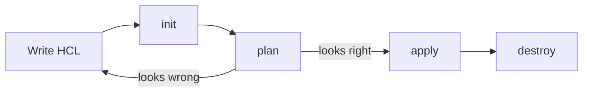

[](./README.md)
[](./README.md)
[](./02-terraform-init.md)

# The Core Terraform Workflow (Write → Plan → Apply)

> **Pitch (1 line):** the canonical loop is **Write → Plan → Apply**; `init` bootstraps the directory once, and `destroy` tears it all down.

## 🎯 What the exam tests

- The **order** and job of each command — and that `init` must run **before** plan/apply.
- That `plan` changes **nothing** and `apply` is what actually mutates infrastructure.
- That the same workflow is provider-agnostic (AWS, Azure, GCP… same 3 verbs).

## 🧠 Core (non-obvious bits)

- **Write** HCL → **`plan`** previews the diff → **`apply`** executes it. That's the whole loop; you iterate Write↔Plan until the plan looks right, then Apply.
- **`init` is a prerequisite, not part of the daily loop** — you run it once per new/changed directory (new provider, new module, changed backend), not every cycle.
- **`plan` is read-only**; **`apply` re-runs a plan** and then executes. Nothing outside `apply`/`destroy` touches real infra.
- **`destroy`** = an apply whose plan is "delete everything in state" (`apply -destroy`).
- **`validate`** and **`fmt`** are side checks (offline correctness / style) — not steps that reach the cloud.

## 💻 Syntax / Example

```bash
terraform init      # one-time: providers, modules, backend
terraform validate  # optional: offline syntax/consistency check
terraform plan      # preview the diff (no changes)
terraform apply     # execute (prompts for approval)
terraform destroy   # tear everything down
```

## 🖼️ Diagram



---

[](./README.md)
[](./README.md)
[](./02-terraform-init.md)
