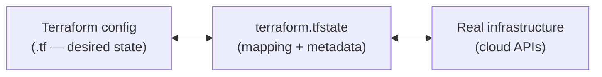

[](./README.md)
[](./README.md)
[](./02-backends-and-state-storage.md)

# Terraform State (`.tfstate`)

> **Pitch (1 line):** the JSON file (`terraform.tfstate`) that **maps your config to real-world resources** — Terraform's single source of truth; it cannot operate without it.

## 🎯 What the exam tests

- **What state is** and why it's needed: config ↔ real resource mapping + metadata (dependencies, provider, order of operations).
- That state **stores everything, including secrets, in plain text** → never commit it.
- That Terraform does a **refresh before operations** to reconcile state with real infra.

## 🧠 Core (non-obvious bits)

- JSON file, **default name `terraform.tfstate`**, in the working directory. Acts as a **database** mapping each resource in the config to its real remote object (by **ID**).
- Also stores **metadata** — resource **dependencies / relationships**, the **provider** used, order of operations. This is *how* Terraform knows what to create/destroy and in what order.
- **Before any operation Terraform refreshes** state against the real world so `plan` diffs against reality, not a stale snapshot.
- **Secrets land in state as plain text** (generated passwords, private keys, DB creds). → treat the file as sensitive, `.gitignore` it, use a remote backend with encryption.
- **Terraform can't operate without state.** Lose it and Terraform no longer knows what it manages (→ [state drift & lost state](./04-state-drift-refresh-only.md)).
- **Never hand-edit `.tfstate`.** Use the CLI / config-driven blocks — a bad manual edit corrupts the mapping.

## 💻 Syntax / Example

```jsonc
// terraform.tfstate (abbreviated) — you read it, you don't edit it by hand
{
  "version": 4,
  "terraform_version": "1.12.0",
  "resources": [
    {
      "type": "aws_instance",
      "name": "web",
      "instances": [
        {
          "attributes": {
            "id": "i-0abc123def456",        // ← the real-world resource ID (the mapping)
            "ami": "ami-0abc",
            "private_ip": "10.1.2.3",
            "password": "S3cr3t-in-plain-text" // ← secrets are NOT encrypted in state
          }
        }
      ]
    }
  ]
}
```

## ⚠️ Common traps

- "Where does Terraform keep secrets / sensitive values?" → **in state, in plain text** (encryption is the *backend's* job, not the file's).
- Losing state ≠ losing infra — the infra keeps running, but Terraform loses track and a plan wants to **recreate everything**.
- Don't confuse the **state file** (what exists) with the **config** (what you want) — `plan` is the diff between them.

## 🔄 Easily confused with

- → [local vs remote backend](../../comparativas/local-vs-remote-backend.md) (where the file lives)

## 🖼️ Diagram



---

[](./README.md)
[](./README.md)
[](./02-backends-and-state-storage.md)
