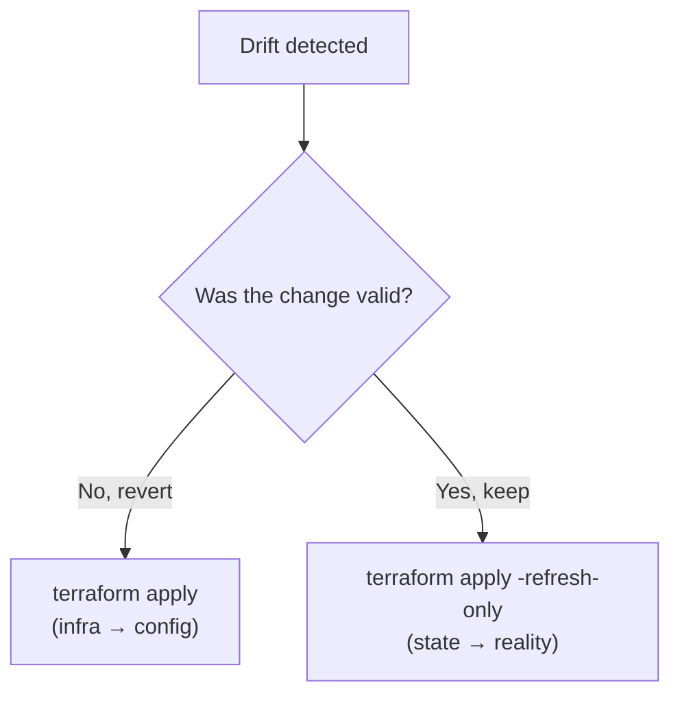

[](./03-inspecting-state.md)
[](./README.md)
[](./05-workspaces.md)

# State Drift & Refresh-Only Mode

> **Pitch (1 line):** drift = real infra changed **outside Terraform**; fix it by **reverting** (`terraform apply`) or **accepting** (`terraform apply -refresh-only`).

## 🎯 What the exam tests

- Definition of **drift** and the **two** ways to resolve it.
- **`-refresh-only`**: `plan -refresh-only` (safe preview) vs `apply -refresh-only` (writes **state**, not infra).
- That a **normal `apply` reverts** drift — config is the source of truth.
- What happens if you **lose state**.

## 🧠 Core (non-obvious bits)

- **Drift** = someone changed the real infrastructure out-of-band (e.g. edited a VM in the portal) → state no longer matches reality. Terraform detects it on the next refresh.
- **Revert the change → `terraform apply`.** Your `.tf` files are the source of truth, so a plain apply pushes infra **back** to match config. Use when the manual change was a mistake / unauthorized.
- **Accept the change → `terraform apply -refresh-only`.** Reality becomes the truth: it **updates the state file** to match the drifted objects, **without touching infra** and **without changing your config**. Use when the change is valid and you want to keep it.
- **`terraform plan -refresh-only`** = preview what a refresh *would* change in state; **makes no modifications** — investigate drift here first.
- Refresh-only mode is the modern replacement for the standalone `terraform refresh` (which auto-approved state writes with no preview).
- **Lose your state?** Infra keeps running, but Terraform loses track → the next plan wants to **recreate everything**. Recovery = remote-backend **versioning/backups**, or re-adopt resources with **`import`**.

## 💻 Syntax / Example

```bash
terraform plan  -refresh-only     # PREVIEW: what would change in STATE (no writes)
terraform apply -refresh-only     # ACCEPT drift: update STATE to match reality (infra untouched)

terraform apply                   # REVERT drift: change INFRA back to match config
```

## 🚩 Flags & values to memorize

- **`plan -refresh-only`** → preview only, **no state or infra change**.
- **`apply -refresh-only`** → updates the **state file only** (infra untouched).
- **plain `apply`** → changes **infra** to match config (reverts drift).
- Decision: mistake/unauthorized → **revert** (`apply`) · valid change → **accept** (`apply -refresh-only`).

## ⚠️ Common traps

- `-refresh-only` **never changes infrastructure** — it only reconciles state. If the question wants infra changed, that's a normal `apply`.
- `plan -refresh-only` writes **nothing**; only `apply -refresh-only` commits the state update.

## 🔄 Easily confused with

- `refresh` vs `plan` → see [glosario](../../glosario.md) ("Pares que más se confunden").

## 🖼️ Diagram



---

[](./03-inspecting-state.md)
[](./README.md)
[](./05-workspaces.md)
