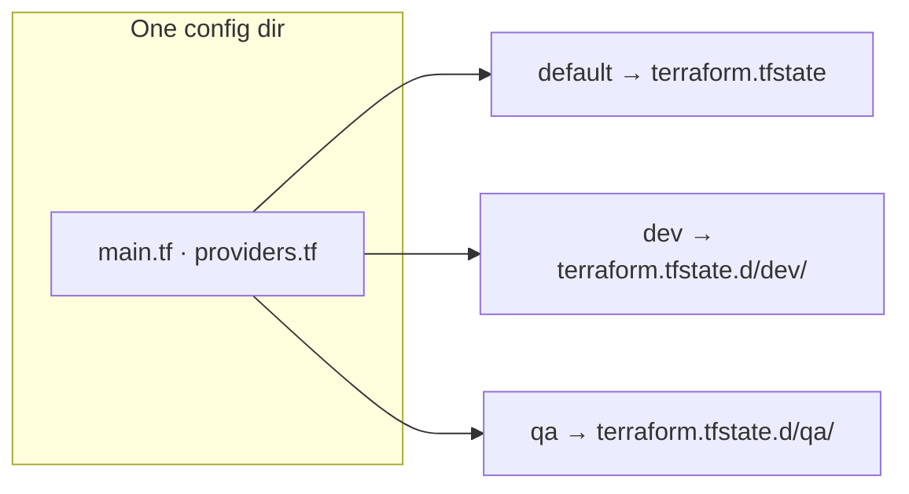

[](./04-state-drift-refresh-only.md)
[](./README.md)
[](../07-maintain/README.md)

# Workspaces (CLI)

> **Pitch (1 line):** CLI workspaces = **multiple isolated state files for one configuration**, so the same code runs against dev/qa/prod without duplicating it.

## 🎯 What the exam tests

- What a workspace is: a **named container for a separate instance of state**.
- Where non-default workspace state lives: **`terraform.tfstate.d/<name>/`** (the `default` stays in the root).
- The `terraform workspace` subcommands: **`list` / `new` / `select` / `show` / `delete`**.
- **CLI workspaces vs HCP Terraform workspaces** — a favorite trap.

## 🧠 Core (non-obvious bits)

- One config directory → **many states**: same code across environments, each with **isolated state**, **no code duplication** or manual syncing.
- **`default`** workspace always exists; its state stays as `terraform.tfstate` in the root dir.
- Non-default workspaces store state under **`terraform.tfstate.d/<name>/terraform.tfstate`** (Terraform creates the `terraform.tfstate.d/` dir on first `workspace new`).
- Reference the active workspace in config with **`terraform.workspace`** → vary names/sizing per env (e.g. `name = "web-${terraform.workspace}"`).
- A brand-new workspace starts with **empty state** — `terraform state list` right after → *"No state file was found!"*.
- **CLI ≠ HCP workspaces:** CLI = many states behind **one backend + one codebase**; HCP = a full cloud working directory (its own config, variables, state, VCS link, run history).

## 💻 Syntax / Example

```bash
terraform workspace list          # list all; * marks the current one
#   default
# * qa
#   dev

terraform workspace new dev       # create AND switch to "dev"
terraform workspace select qa     # switch to an existing workspace
terraform workspace show          # print the current workspace name
terraform workspace delete dev    # delete a workspace (not the current one)
```

```hcl
# use the active workspace inside config
resource "aws_instance" "web" {
  tags = { Name = "web-${terraform.workspace}" }   # web-dev, web-qa, ...
}
```

## 🚩 Flags & values to memorize

- **`new`** = create **+ switch** · **`select`** = switch to existing · **`show`** = current · **`delete`** = remove.
- Default workspace state → root `terraform.tfstate`; others → **`terraform.tfstate.d/<name>/`**.
- Interpolation: **`terraform.workspace`** (a value, no `var.`).

## ⚠️ Common traps

- Workspaces are a **lightweight** way to split environments — **not** a strong isolation boundary: they share the **same backend & credentials**. For hard prod separation HashiCorp recommends **separate directories / backends**.
- CLI workspace ≠ HCP workspace — different concept entirely.
- Switching workspace doesn't move resources; each workspace's state is independent.

## 🔄 Easily confused with

- → [CLI workspaces vs HCP workspaces](../../comparativas/cli-workspaces-vs-hcp-workspaces.md)

## 🖼️ Diagram



---

[](./04-state-drift-refresh-only.md)
[](./README.md)
[](../07-maintain/README.md)
