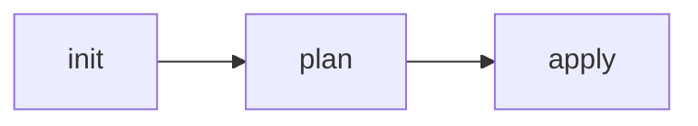

<!--
CARD TEMPLATE — Terraform Associate (004)
=========================================
How to use:
1. Copy this file into the matching block folder (cards/NN-block/).
2. Rename using: NN-short-name.md (NN = order within the block).
3. Update the 3 navigation buttons (top and bottom) with the real prev/next files.
4. If the card is the first/only one in the block, point prev/next to the block's README.

WHY THIS TEMPLATE DIFFERS FROM THE SAA ONE:
- SAA was scenario-based ("which service fits this situation?") → its cards led with
  trigger phrases ("When the exam picks this").
- Terraform Associate is PRACTICAL and PRECISE: HCL syntax, what each command/flag does,
  how state behaves, precedences. So the card must SHOW the code/command, not just
  describe a service. The "💻 Syntax / Example" section is the heart of the card.

CONVENTIONS (locked — do not deviate without asking):
- LANGUAGE: English only. The exam is English-only, so cards mirror it for immersion.
- ONE TOPIC = ONE CARD. Never split a single topic across two cards just for length.
- GOLDEN RULE OF THIS EXAM: for every concept, WRITE IT AND RUN IT. A card should capture
  what you confirmed by running `terraform`, not what you read in the docs.
- CONTENT: do not transcribe docs. Only what is non-obvious, a precise flag/precedence,
  or what already tricked you in a practice test. Long versus comparisons live in
  /comparativas, not here — link them.
- IMAGES (mixed model):
    * Conceptual flows (workflow, state locking, dependency graph) -> Mermaid (inline).
    * A real diagram that adds value -> download into ../../assets/ and link LOCALLY.
      Never link fragile external URLs; never link a file that doesn't exist yet.

SECTIONS — which are required:
- ALWAYS: nav buttons, title, Pitch, "What the exam tests", "Core", "Syntax / Example".
- IF APPLICABLE: "Flags & values to memorize" (precedences, default values, version
  operators), "Easily confused with" (real comparison → link /comparativas).
- OPTIONAL (only when it genuinely adds value): "Common traps", "Diagram".
-->

[](./PREV.md)
[](./README.md)
[](./NEXT.md)

# <Command / concept / HCL block>

<!-- ALWAYS -->
> **Pitch (1 line):** what it is / what it does, in a single sentence.

<!-- ALWAYS -->
## 🎯 What the exam tests

- What they'll actually ask about this (a precedence, which command, what happens if…).
- The angle the exam likes — not a generic description.

<!-- ALWAYS -->
## 🧠 Core (non-obvious bits)

- Bullet for something NOT evident from the name.
- A behavior that shows up in exam questions.
- Cap at 4-6 bullets.

<!-- ALWAYS for Terraform: show the code or the command -->
## 💻 Syntax / Example

```hcl
# Minimal, correct HCL — or the CLI command + the flags that matter.
resource "random_pet" "example" {
  length = 2
}
```

<!-- IF APPLICABLE: precedences, default values, version-constraint operators, flags -->
## 🚩 Flags & values to memorize

- Flag `-x`: what it does.
- Default value Y: value (and when it changes).

<!-- OPTIONAL: only if there's a real trap worth flagging -->
## ⚠️ Common traps

- "If they say X…" → correct answer.
- "If they say Y…" → NOT this, use the other one.

<!-- IF APPLICABLE: only if there's a real comparison with another concept -->
## 🔄 Easily confused with

- → [vs <concept A>](../../comparativas/this-vs-A.md)

<!-- OPTIONAL: Mermaid for concepts; a local image for a real diagram -->
## 🖼️ Diagram



---

[](./PREV.md)
[](./README.md)
[](./NEXT.md)
